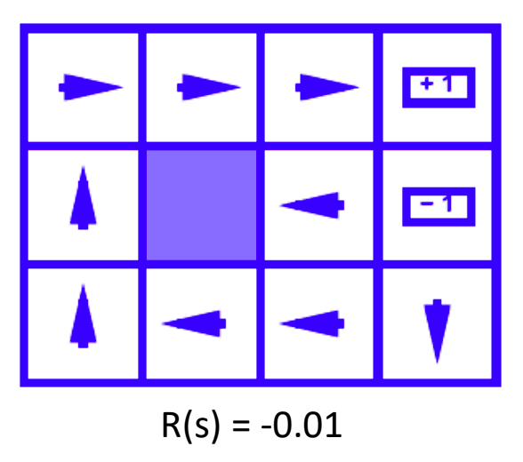
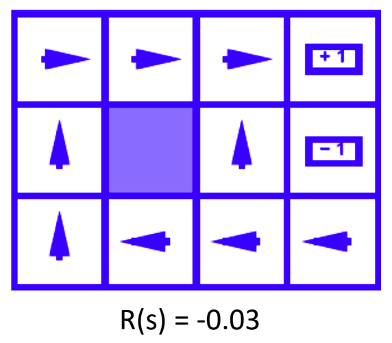
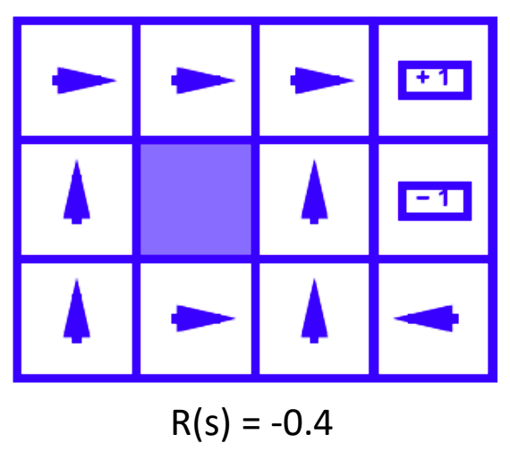
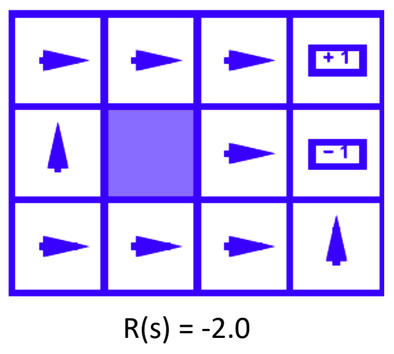
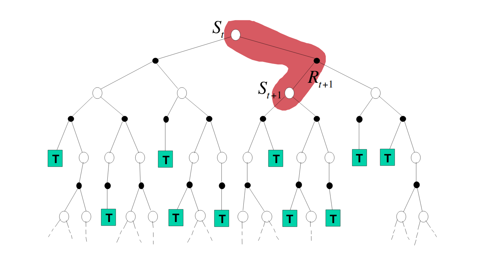

<!-- .slide: data-background="./img/blue_galactic_neural_nets.jpg" -->
<h2 class="title">Introduction to Reinforcement Learning</h2>

### Contents
 

1. Motivation
2. Core concepts
3. Learning
4. Challenges

### Resources
 

Textbooks:

- Sutton, _Reinforcement Learning: An Introduction_, 2nd edition
- Pineau, _An introduction to Deep RL_
- Szepesvari, _Algorithms for Reinforcement Learning_

### Resources
 

Online lectures:

- [Udacity, Reinforcement Learning](https://www.udacity.com/course/reinforcement-learning--ud600)
- [DeepMind, Advanced DL and RL](https://github.com/enggen/DeepMind-Advanced-Deep-Learning-and-Reinforcement-Learning)
- [Silver, Introduction to RL](https://youtu.be/2pWv7GOvuf0)

<!-- .slide: data-background-iframe="https://spinningup.openai.com/en/latest/spinningup/keypapers.html" data-background-interactive -->

### Evaluation
 

- Three labs. Can be submitted the following week too.
- Pick a paper from a list of four and answer a couple of questions by the end
of the module.

### Why Reinforcement Learning?
 

> Intelligence measures an agent's ability to achieve goals in a wide range of environments.

`$$
\xi(\pi)=\sum_{\mu \in \mathcal{M}} 2^{-K(\mu)} V_{\mu}^{\pi}
$$`

<small class="cite">(Legg & Hutter, 2007)</small>

<!-- .slide: data-background-color="#fff" data-background="./img/action_perception_loop.png" data-background-size="70%" -->

### Why Reinforcement Learning?
 

- **Supervised learning:** mapping from data to values or classes, requires
    labeled data.
- **Unsupervised learning:** mapping from data to 
    interesting patterns.

### Why Reinforcement Learning?
 

By contrast, RL differes in that:

- there is no labeled data, only a reward signal
- reward may be delayed
- it is essentially an online setting
- data is highly correlated in time
- data distribution changes depending on the actions

<!-- .slide: data-background="./img/covers.png" data-background-size="50%" -->

<!-- .slide: data-background-color="#fff" data-background="./img/alpha_go.png" data-background-size="30%" -->

<!-- .slide: data-background-color="#fff" data-background="./img/td_gammon.png" data-background-size="50%" -->

<!-- .slide: data-autoplay data-background-iframe="https://www.youtube.com/embed/kopoLzvh5jY" -->

<!-- .slide: data-background-color="#000" data-background="./img/rl_paint.png" data-background-size="60%" -->

<h3>How about RL in the Real Life</h3>
 

- Online advertising
- Data center energy optimization
- Dialogue systems
- [RL for Real Life ICML workshop](https://sites.google.com/view/RL4RealLife#h.p_E8GavvJ-X7nT)
- Robotics?

### What is RL?
 

<q>Reinforcement learning is learning what to do - how to map situations to
actions - so as to maximize a numerical reward signal.</q>
<small class="cite">(Sutton, 2019)</small>

<q>Science of learning to make decisions from interaction</q>
<small class="cite">(van Hasselt, 2019)</small>

<!-- .slide: data-background-color="#fff" data-background="./img/treasure_hunt.png" data-background-size="40%" -->

### Optimal policies
 

    
    
    
    

<small class="cite fragment">(Dragan, 2019)</small>

<!-- .slide: data-background-color="#fff" data-background="./img/action_perception_loop.png" data-background-size="70%" -->

### Concepts
 

- Reward $R_t$. Scalar signal, performance at step $t$.
- Action $A_t$. Action taken by the agent according to:
    - Deterministic policy $a_t = \pi(s_t)$.
    - Stochastic policy $a_t \sim \pi(a_t | s_t)$.
- Observation $O_t.$ High-dimensional vector, different from the environment state.
- State $S_t$. Internal state of the environment.

### Return
 

Return: $G_t = R_{t+1} + R_{t+2} + R_{t+3} ... $

 
Discounted return:

$$G_t = R_{t+1} + \gamma R_{t+2} + \gamma^2 R_{t+3} + ...$$

 

Recursive: $G_t = R_{t+1} + \gamma G_{t+1}$

<h3>Reward hypothesis:</h3>

<q>Any goal can be formalized as the outcome of maximizing a cumulative reward.</q>

 

See also the General Value Function framework.

### Value Function
 

`$$
    v^{\pi}(s) = \mathbb E_{\pi} [R_{t+1} + \gamma R_{t+2} + \gamma^2 R_{t+3} + ... + \gamma^{T-1} R_{T} | S_t = s, \pi]
$$`

- The value depends on the policy $\pi$
- Value functions are used to evaluate the utility of an action 
- Or to select between actions.

<h3>Bellman equation</h3>
 

Since the return $G_t$ has a recursive form,

`$$
\begin{aligned}
    v^{\pi}(s)
    & = \mathbb E_{\pi} [R_{t+1} + \gamma G_{t+1} | S_t = s, \pi] \\
    & = \mathbb E_{\pi} [R_{t+1} + \gamma v^{\pi}(s_{t + 1}) | S_t = s, \pi] \\
\end{aligned}
$$`

And this holds for the optimal value also:

`$$
    v^*(s) = \text{max}_a \mathbb{E} [R_{t+1} + \gamma v^*(s_{t + 1}) | S_t = s, a=a]
$$`

### Action-Value Function
 

`$$
    q^{\pi}(s,a) = \mathbb E_{\pi} [R_{t+1} + \gamma G_{t+1} | S_t = s, A_t = a, \pi]
$$`

It's related to the value function in that:
`$$
    v^{\pi}(s) = \mathbb{E}_{a \sim \pi} [q^{\pi}(s,a)]
$$`

$v^{\pi}(s), q^{\pi}(s,a), v^{\ast}(s), q^{\ast}(s,a)$ are theoretical objects

While $V_{t}(s), Q_t(s,a)$ are their estimates.

### Policy Evaluation
 

`$$
\begin{aligned} v_{\pi}(s) & \doteq \mathbb{E}_{\pi}\left[G_{t} | S_{t}=s\right] \\ &=\mathbb{E}_{\pi}\left[R_{t+1}+\gamma G_{t+1} | S_{t}=s\right] \\ &=\mathbb{E}_{\pi}\left[R_{t+1}+\gamma v_{\pi}\left(S_{t+1}\right) | S_{t}=s\right] \\ &=\sum_{a} \pi(a | s) \sum_{s^{\prime}, r} p\left(s^{\prime}, r | s, a\right)\left[r+\gamma v_{\pi}\left(s^{\prime}\right)\right] \end{aligned}
$$`

### Iterative Policy Evaluation
 

Imagine a succession of approximate value functions $v_0, v_1, v_2$:

`$$
\begin{aligned} 
    v_{k+1}(s) 
        & \doteq \mathbb{E}_{\pi}\left[R_{t+1}+\gamma v_{k}\left(S_{t+1}\right) | S_{t}=s\right] \\
        &=\sum_{a} \pi(a | s) \sum_{s^{\prime}, r} p\left(s^{\prime}, r | s, a\right)\left[r+\gamma v_{k}\left(s^{\prime}\right)\right]
\end{aligned}
$$`

$v_k$ can be shown to converge as $k \to \infty$

### Iterative Policy Evaluation II
 

For action-value functions:

`$$
    Q^{\pi}(s, a)=r(s, a)+\gamma \mathbb{E}_{s^{\prime} \sim P\left(s^{\prime} | s, a\right), a^{\prime} \sim \pi}\left[Q^{\pi}\left(s^{\prime}, a^{\prime}\right)\right]
$$`

### Policy Improvement
 

Say we determined $v_{\pi}$ for some arbitrary policy. Should we change the policy?

Would we get a better $v_{\pi}$?

`$$
    \pi^{n e w}(. | s)=\arg \max _{a} Q^{\pi}(s, a)
$$`

It turns out this is guaranteed to be an improvement.

<!-- .slide: data-background-iframe="https://cs.stanford.edu/people/karpathy/reinforcejs/gridworld_dp.html" data-background-interactive -->

### Generalized Policy Iteration
 

### Monte Carlo

`$$
V(s_t) \leftarrow V(s_t) + \alpha[G_t - V(s_t)]
$$`

### One-step Temporal Difference

`$$
V(s_t) \leftarrow V(s_t) + \alpha[r_{t+1} + \gamma V(s_{t+1}) - V(s_t)]
$$`

<!-- .slide: data-background-iframe="https://distill.pub/2019/paths-perspective-on-value-learning/" data-background-interactive -->

### On-Policy Control
 

<small>SARSA update:</small>

<small>
$$
Q\left(S_{t}, A_{t}\right) \leftarrow Q\left(S_{t}, A_{t}\right)+\alpha\left[R_{t+1}+\gamma Q\left(S_{t+1}, A_{t+1}\right)-Q\left(S_{t}, A_{t}\right)\right]
$$
</small>

### Off-Policy Control

<small>Q-learning update: </small>
<small>
$$
Q(s_t, a_t) \leftarrow
    Q(s_t, a_t) + \alpha[R_{t+1} + \gamma \mathop{\arg\max}\limits_{a_{t+1}} Q(s_{t+1},a_{t+1}) - Q(s_t, a_t)]
$$
</small>

<small>Expected SARSA update: </small>

<small>
$$
\begin{aligned} 
    Q\left(S_{t}, A_{t}\right) 
        & \leftarrow Q\left(S_{t}, A_{t}\right)+\alpha\left[R_{t+1}+\gamma \mathbb{E}_{\pi}\left[Q\left(S_{t+1}, A_{t+1}\right) | S_{t+1}\right]-Q\left(S_{t}, A_{t}\right)\right] \\
        & \leftarrow Q\left(S_{t}, A_{t}\right)+\alpha\left[R_{t+1}+\gamma \sum_{a} \pi\left(a | S_{t+1}\right) Q\left(S_{t+1}, a\right)-Q\left(S_{t}, A_{t}\right)\right]
\end{aligned}
$$
</small>

<!-- .slide: .centered data-background-color="#0f132d" -->
<h2 class="title">So, is RL done?</h2>

### The rest of the course

 
Take a linear approximator:

`$$
\hat{v}(s, \mathbf{w}) \doteq \mathbf{w}^{\top} \Phi(s) \doteq \sum_{i=1}^{d} w_{i} \phi_{i}(s)
$$`

compose it with some non-linear feature extractor $\Phi(s)$

<!-- .slide: data-background-color="#fff" data-background="./img/landscape.png" data-background-size="40%" -->

# Questions?
