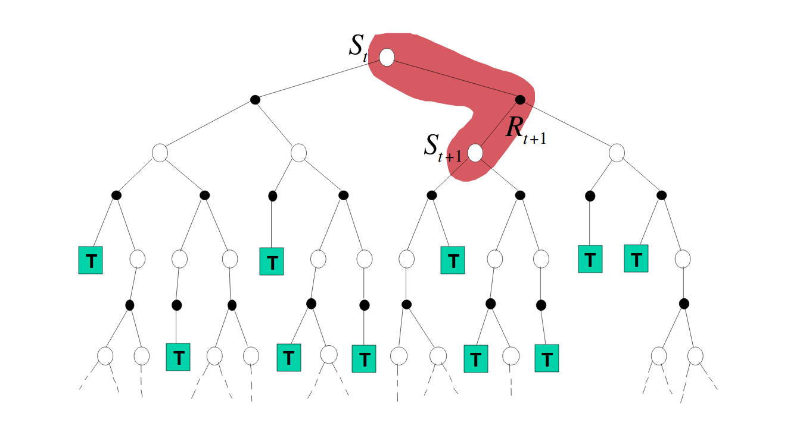
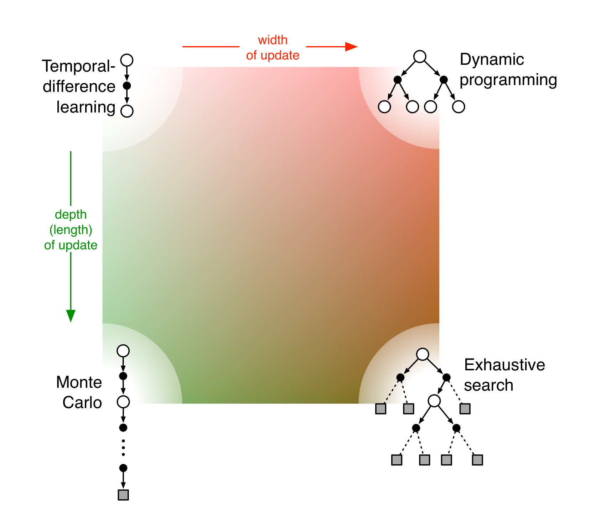

<!-- .slide: data-background="./img/blue_galactic_neural_nets.jpg" -->
<h2 class="title">Approximate Methods</h2>

### Contents
 

1. MDP review
2. Approximate solution methods
3. Deep RL
4. Auxiliary tasks
5. Back to where we started?

<!-- .slide: data-background-color="#fff" data-background="./img/landscape.png" data-background-size="40%" -->

### Concepts
 

- Reward $R_t$. Scalar signal, performance at step $t$.
- Action $A_t$. Action taken by the agent according to:
    - Deterministic policy $a_t = \pi(s_t)$.
    - Stochastic policy $a_t \sim \pi(a_t | s_t)$.
- Observation $O_t.$ High-dimensional vector, different from the environment state.
- State $S_t$. Internal state of the environment.

### Markov Decision Process
 

- $\mathcal{S}$: state space ($s_t = o_t$),
- $\mathcal{A}$: the action space,
- $T:\mathcal{S} \times \mathcal{A} \times \mathcal{S} \rightarrow [0, 1]$: transition function
- $R:\mathcal{S} \times \mathcal{A} \times \mathcal{S} \rightarrow \mathcal{R}$: reward function
- $\gamma \in [0, 1)$ is the discount factor.

### Markov Property
 

For a process to be markovian:
 
 

- $P(o_{t+1} | o_t, a_t) = P(o_{t+1} | o_{t:0}, a_{t:0})$
- $P(r_t | o_t, a_t) = P(r_t | o_{t:0}, a_{t:0})$

 
 
That is, the future of the process depends only on present.

<!-- .slide: data-background-color="#fff" data-background="./img/action_perception_loop.png" data-background-size="70%" -->

### Bellman Operator (I)
`$$
\begin{aligned}
    Q^{\pi}(s,a)
    & = \mathbb E_{\pi} \left[R(s, a, s') + \gamma G_{t+1} | S_t = s, A_t = a, \pi\right] \\
    & = \sum_{s^{\prime} \in S} T\left(s, a, s^{\prime}\right)\left[R\left(s, a, s^{\prime}\right)+\gamma Q^{\pi}\left(s^{\prime}, a=\pi\left(s^{\prime}\right)\right)\right] \\
\end{aligned}
$$`

The optimal $Q^*(s,a)$ function is defined as:

`$$
    Q^*(s, a) = \max_{\pi \in \Pi} Q^{\pi}(s, a)
$$`

### Bellman Operator (II)
 

We can also write the optimal state-action value as:

`$$
    Q^{\ast}(s, a) = \left(\mathcal{B} Q^{*}\right)(s, a)
$$`

where $\mathcal{B}$ is the Bellman Operator:

`$$
(\mathcal{B} K)(s, a)=\sum_{s^{\prime} \in S} T\left(s, a, s^{\prime}\right)\left(R\left(s, a, s^{\prime}\right)+\gamma \max _{a^{\prime} \in \mathcal{A}} K\left(s^{\prime}, a^{\prime}\right)\right)
$$`

The fixed point exists because it can be shown that $\mathcal{B}$ is a contraction mapping:
`$$
\left\| TK - TK' \right\|_{\infty} \le \gamma \left\| K - K' \right\|_{\infty}
$$`

### Convergence
 

A general proof for the convergence to the optimal function in Watkins & Dayan, 1992.

- State-action pairs have a discrete representation,
- Sufficient exploration (all states visited, all actions taken, repeatedly).

<!-- .slide: .centered data-background-color="#0f132d" -->
<h2 class="title">Value Function Approximation</h2>

### VFA Objective
 

`$$
\overline{\mathrm{VE}}(\mathbf{w}) \doteq \sum_{s \in \mathcal{S}} \mu(s)\left[v_{\pi}(s)-\hat{v}(s, \mathbf{w})\right]^{2}
$$`

- minimize the good old Mean Squared Error,
- weighted by the state distribution $\mu(s)$.
- SGD will converge to a local minimum,
- Linear VFA has only one local minimum.

### SGD
 

`$$
\begin{aligned}
    \mathbf{w}_{t+1}
        & \doteq \mathbf{w}_{t}-\frac{1}{2} \alpha \nabla\left[v_{\pi}\left(S_{t}\right)-\hat{v}\left(S_{t}, \mathbf{w}_{t}\right)\right]^{2} \\
        &=\mathbf{w}_{t}+\alpha\left[v_{\pi}\left(S_{t}\right)-\hat{v}\left(S_{t}, \mathbf{w}_{t}\right)\right] \nabla \hat{v}\left(S_{t}, \mathbf{w}_{t}\right)
    \end{aligned}
$$`

This is guaranteed to converge as $\alpha \rightarrow 0$ under some conditions. 

But we generaly don't know $v_{\pi}(S_{t})$!

### Monte Carlo VFA

`$$
    \mathbf{w} \leftarrow \mathbf{w}+\alpha\left[G_{t}-\hat{v}\left(S_{t}, \mathbf{w}\right)\right] \nabla \hat{v}\left(S_{t}, \mathbf{w}\right)
$$`

### One-step Temporal Difference VFA

`$$
\mathbf{w} \leftarrow \mathbf{w}+\alpha\left[R+\gamma \hat{v}\left(S^{\prime}, \mathbf{w}\right)-\hat{v}(S, \mathbf{w})\right] \nabla \hat{v}(S, \mathbf{w})
$$`

This is not a full gradient anymore!

### Semi-Gradient Methods

`$$
\mathbf{w} \leftarrow \mathbf{w}+\alpha\left[U_t-\hat{v}(S, \mathbf{w})\right] \nabla \hat{v}(S, \mathbf{w})
$$`

- If $U_t$ is an unbiased estimate of $v^{\pi}(S_t)$, such as $G_t$, all good!
- When bootstrapping however: $U_t = R+\gamma \hat{v}\left(S^{\prime}, \mathbf{w}\right)$
    - the target *depends* on the current $\mathbf{w}$.

Semi-gradient takes into account the effect of changing $\mathbf{w}$ on the estimate but ignore its effect on the target.

### Before NN Approximators
 

Take a linear approximator:

`$$
\hat{v}(s, \mathbf{w}) \doteq \mathbf{w}^{\top} \Phi(s) \doteq \sum_{i=1}^{d} w_{i} \phi_{i}(s)
$$`

and compose it with some non-linear feature extractor $\Phi(s)$.

How about convergence? Gordon, 1999, shows Watkins & Dayan's results holds only for certain $\Phi(s)$.

<!-- .slide: data-background-color="#fff" data-background="./img/geometrical.png" data-background-size="70%" -->

### MC vs TD

- Monte Carlo is gradient-based, converges to a local optimum of the weighted MSE
- Temporal-Difference Learning (TD) fits (conceptually) a Markovian model
- Approximates the Value Function that would be computed from the model
- TD introduces further bias in order to reduce variance
- Bias comes from Markov assumption, use of current (incorrect) value estimates

(Precup, 2019)

### n-step TD

### n-step TD Control (I)
 

- One-step return: $G_{t: t+1} \doteq R_{t+1}+\gamma V_{t}\left(S_{t+1}\right)$
- Two-step return: $G_{t: t+2} \doteq R_{t+1}+\gamma R_{t+2}+\gamma^{2} V_{t+1}\left(S_{t+2}\right)$

n-step SARSA Control:

`$$
G_{t: t+n} \doteq R_{t+1}+\gamma R_{t+2}+\cdots+\gamma^{n-1} R_{t+n} \\
    + \gamma^{n} \hat{Q}\left(S_{t+n}, A_{t+n}, \mathbf{w}_{t+n-1}\right)
$$`

### n-step TD Control (I)
 

<!-- .slide: .centered data-background-color="#0f132d" -->
<h2 class="title">... Needs more layers</h2>

### Neural Fitted Q-Learning

- Dataset $\mathcal{D} = \{<s, a, r, s^{\ast}>\}$
- Build target: $Y_k^{Q} = r + \gamma \max_{a^{\ast}} Q(s^{\ast}, a^{\ast}; \theta_k$

Minimize the loss:
`$$
\mathcal{L}_{\text{NFQ}} = \left[Q(s, a; \theta_k) - Y^{Q}_k \right]^2
$$`

Problem: Updating $\theta$ also updates the target.

### Deep Q-networks (II)
 

 

$$
\mathcal{L}_{\text{DQN}}(\boldsymbol{\theta})=\mathbb{E}_{\left(s, a, r, s^{\prime}\right) \sim U(\mathcal{D})}
    \big[\underbrace{r+\gamma \max _{a^{\prime}} Q\left(s^{\prime}, a^{\prime} ; \boldsymbol{\theta}^{-}\right)}_{\text {refined estimate }}-\underbrace{Q(s, a ; \boldsymbol{\theta})}_{\text {current estimate }})^{2}\big]
$$

### Deep Q-networks (II)

- introduces a separate target network
- adapts Experience Replay  from (Lin, 1992)
- last four frames are grayscaled and stacked
- rewards are clipped to [-1, 1]
- loss of life = terminal state
- actions are repeated four times
- optimized with RMSprop

Huge leap over previous linear estimators with handcrafted feature extractors.

### Action Overestimation

- random estimation errors
- the approximator is not expressible
- non-stationarity of the data
- the $\texttt{max}$ operator is positively biased

### Maximization bias (I)
 

Suppose $Q(s, a; \theta) + \epsilon$ with $\mu=0$:

the target can be overestimated up to

`$$
    \gamma\epsilon\frac{m-1}{m+1}
$$`

### Maximization bias (II)
 

 
Even in tabular settings!

### Double Q-learning

- Set two estimates, $Q_1(a), Q_2(a)$ and use them to:
    - determine the maximizing action $A^{\ast} = \text{argmax}_{a} Q_1(a)$,
    - estimate its value $Q_2(A^{\ast}) = Q_2(\text{argmax}_{a} Q_1(a))$,
    - then randomly switch roles.

`$$
Y_{k}^{D D Q N}=r+\gamma Q\left(s^{\prime}, \underset{a \in \mathcal{A}}{\operatorname{argmax}} Q\left(s^{\prime}, a ; \theta_{k}\right) ; \theta_{k}^{-}\right)
$$`

<!-- .slide: data-background-color="#fff" data-background="./img/ddqn_results.png" data-background-size="60%" -->

### Dueling DQN (I)

- from the definition:

`$$
    V^{\pi}(s) = \mathbb E_{a \sim \pi(s)} \,[Q^{\pi}(s,a)]
$$`

- derive the advantage some action has with respect to $V(s)$

`$$
    A^{\pi}(s,a) = Q^{\pi}(s,a) - V^{\pi}(s)
$$`

- that is, for optimal action $a^{\ast}$: $A^{\pi}(s, a^{\ast}) = 0$

### Dueling DQN (II)
 

- Naively:
`$$
    Q(s,a; \theta, \alpha, \beta) = V(s;\theta, \beta) + A(s,a;\theta, \alpha)
$$`

### Dueling DQN (III)

- However we can't recover unique V and A so we force $A(s, a) = 0$ for the action taken:

`$$
\begin{aligned}
    Q(s,a; \theta, \alpha, \beta) = & V(s;\theta, \beta) \\
        & + (A(s,a;\theta, \alpha) - \mathop{\max}\limits_{a'\in |\mathcal A|} A(s,a';\theta, \alpha))
\end{aligned}
$$`

 - In practice:

`$$
\begin{aligned}
 Q(s,a; \theta, \alpha, \beta) = & V(s;\theta, \beta) \\
        & + (A(s,a;\theta, \alpha) - \frac{1}{|\mathcal A|}\Sigma_{a'}A(s,a';\theta, \alpha))
\end{aligned}
$$`

<!-- .slide: data-background-color="#fff" data-background="./img/dueling_saliency.png" data-background-size="40%" -->

### Prioritized Experience Replay

- Instead of sampling transitions uniformly from the ER...
- Sample those experiences from which the agent would learn the most.
- Specifically, sample $<s,a,r,s^{\ast}>$ tuples with a large absolute TD-error:

$$
\left|\left(r+\gamma \max _{a^{\prime}} Q\left(s^{\prime}, a^{\prime} ; \boldsymbol{\theta}^{-}\right)-Q(s, a ; \boldsymbol{\theta})\right)^{2}\right|
$$

Can we do better than $|\text{TD-error}|$?

### Multi-step learning

Recall the n-step  methods discussed earlier. We can change the target so that we bootstrapp later in the future:

`$$
Y_{k}^{Q, n}=\sum_{t=0}^{n-1} \gamma^{t} r_{t+k+1}+\gamma^{n} \max _{a^{\prime} \in A} Q\left(s_{n}, a^{\prime} ; \theta_{k}\right)
$$`

### Distributional RL
 

 

- Why learn point estimates of the value-functions?
- Why not learn a distribution of returns?

### Distributional Bellman operator
 

 

<ul>
    <li class="fragment">define a value distribution: $Q^{\pi}(s, a)=\mathbb{E} Z^{\pi}(s, a)$</li>
    <li class="fragment">which is also recursive: $Z^{\pi}(s, a)=R\left(s, a, S^{\prime}\right)+\gamma Z^{\pi}\left(S^{\prime}, A^{\prime}\right)$</li>
    <li class="fragment">distributional loss: $D_{\mathrm{KL}}\left(\Phi {\mathcal{T}} Z_{\theta^-}(s, a) \| Z_{\theta}(s, a)\right)$</li>
</ul>

### Yeah, but why?
 

<!-- .slide: data-background-color="#fff" data-background="./img/rainbow.png" data-background-size="40%" -->

##### Auxiliary Tasks

<!-- .slide: .centered data-background-color="#0f132d" -->
<h2 class="title">Back to tabular methods?</h2>

#### Model-Free Episodic Control

- keep a table of the maximum Q-value encountered in that state

`$$
Q^{\mathrm{EC}}\left(s_{t}, a_{t}\right) \leftarrow\left\{\begin{array}{ll}{R_{t}} & {\text { if }\left(s_{t}, a_{t}\right) \notin Q^{\mathrm{EC}}} \\ {\max \left\{Q^{\mathrm{EC}}\left(s_{t}, a_{t}\right), R_{t}\right\}} & {\text { otherwise }}\end{array}\right.
$$`

- how about in novel states?

`$$
\widehat{Q^{\mathrm{EC}}}(s, a)=\left\{\begin{array}{ll}{\frac{1}{k} \sum_{i=1}^{k} Q^{\mathrm{EC}}\left(s^{(i)}, a\right)} & {\text { if }(s, a) \notin Q^{\mathrm{EC}}} \\ {Q^{\mathrm{EC}}(s, a)} & {\text { otherwise }}\end{array}\right.
$$`

#### Neural Episodic Control
 

The loss function is again based on an n-step return.

<!-- .slide: data-background-color="#fff" data-background="./img/nec_results.png" data-background-size="70%" -->

# Questions?