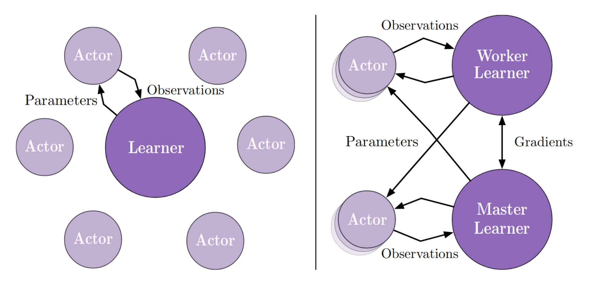

<!-- .slide: data-background-color="#0f132d" data-background="./img/blue_galactic_neural_nets.jpg" -->
<h2 class="title">Advanced PG. RL applications in ML</h2>

### Contents
 

1. Recap++
2. Advanced PG
3. RL applications in ML
4. Practical advice
5. Open problems

<!-- .slide: data-background-color="#0f132d" data-background="./img/alpha_star.jpg" -->
<h2 class="title">AlphaStar: Grandmaster level in StarCraft II</h2>

<ul class="has-dark-background">
    <li class="fragment">$10^26$ actions at each step!</li>
    <li class="fragment">Vast space of strategies...</li>
    <li class="fragment">... not discoverable with naive exploration</li>
    <li class="fragment">Imperfect information</li>
    <li class="fragment">Planning horizon over thousands of steps</li>
</ul>

### So how did they do it?
 

1. Learn a policy with supervized learning (84%)
2. Self-play in a League of main agents and exploiters...
3. ... conditioned on human strategies.

 

    

        The RL part uses an Actor-Critic:
        <ul>
            <li class="fragment">with a $\text{TD}(\lambda)$ critic</li>
            <li class="fragment">importance sampling  for off-policy correction</li>
        </ul>
    

<!-- .slide: data-background-color="#fff" data-background="./img/league_training.png"  data-background-size="90%"  -->

<!-- .slide: .centered data-background-color="#0f132d" -->
<h2 class="title">Recap</h2>

### Value-based methods
 

<ul>
    <li>Episode: $S_0, A_0, R_1, S_1, A_1, R_2, S_2, ...$</li>
    <li class="fragment">Return: 
    $$
    \begin{aligned}
        G_t & \doteq R_{t+1}+\gamma R_{t+2}+\gamma^{2} R_{t+3}+\gamma^{3} R_{t+4}+\cdots \\
            & = R_{t+1}+\gamma\left(R_{t+2}+\gamma R_{t+3}+\gamma^{2} R_{t+4}+\cdots\right) \\
            & = R_{t+1}+\gamma G_{t+1} \end{aligned}
    $$
    </li>
    <li class="fragment"> And we care about:
    $$
    \begin{aligned}
        v_{\pi}(s) 
            & \doteq \mathbb{E}_{\pi}[G_t | S_t=s] \\
            & = \mathbb{E}_{\pi}[R_{t+1} + \gamma G_{t+1} | S_t=s] \\
            & = \mathbb{E}_{\pi}[R_{t+1} + \gamma v_{\pi}(S_{t+1}) | S_t=s]
    \end{aligned}
    $$
    </li>
    <li class="fragment">TD error: $\underbrace{R_{t+1} + \gamma V(S_{t+1})}_{\text{improved estimate}} - \underbrace{V(S_t)}_{\text{current estimate}}$</li>
</ul>

### Approximation 
 

- We can approximate the (action-)value function:
`$$
\begin{aligned}
    V_{\theta}(s) & \approx V^{\pi}(s) \\ Q_{\theta}(s, a) & \approx Q^{\pi}(s, a)
\end{aligned}
$$`

#### One-step Temporal Difference VFA

`$$
\mathbf{\theta} \leftarrow 
    \mathbf{\theta}+\alpha\left[R_t+\gamma V_{\theta}(S_{t+1})-V_{\theta}(S_t)\right] \nabla V_{\theta}(S_t)
$$`

#### Monte Carlo VFA

`$$
    \mathbf{\theta} \leftarrow 
        \mathbf{\theta}+\alpha \left[ G_{t} - V_{\theta}(S_t) \right] \nabla V_{\theta}(S_t)
$$`

### Deep Value-based RL
 

- Neural Fitted Q-learning
- Deep Q-Networks
    - Overestimation
    - Disambiguation 
    - Prioritization
    - Distributional perspective, auxiliary cost functions

Watch out for the deadly triad.

#### Dynamic Programming

$$
    V(S_t) \leftarrow
        \mathbb{E}_{\pi} \left[ R_{t+1} + \gamma V(S_{t+1}) \right] = \sum_{a} \pi(a | S_t) \sum_{s', r} p(s', r | S_t, a)[r + \gamma V(s')]
$$

<!-- .slide: data-background-color="#fff" data-background="./img/unified_view.png" data-background-size="40%" -->

#### Just Parametrize the Policy!
 

<ul>
    <li>Discrete:
        $$
            \pi(a | s, \boldsymbol{\theta}) \doteq \frac{e^{h(s, a, \boldsymbol{\theta})}}{\sum_{b} e^{h(s, b, \boldsymbol{\theta})}}
        $$
    </li>
    <li class="fragment">Continuous:
        $$
            \pi(a | s, \boldsymbol{\theta}) \doteq \mathcal{N}(\mu_{\theta}, \sigma^2_{\theta})
        $$
    </li>
</ul>

#### Objective
 

For performance measure:

`$$
    J(\boldsymbol{\theta}) \doteq v_{\pi_{\boldsymbol{\theta}}}\left(s_{0}\right),
$$`

be able to compute:

`$$
    \boldsymbol{\theta} \leftarrow \boldsymbol{\theta} + \alpha \nabla_{\theta} J(\boldsymbol{\theta}).
$$`

A policy can be optimized with non-gradient methods also!

The score function does not need to be continuous!

### Why Policy Gradients?

- Effective in high-dimensional and continuous actions spaces
- Easier to approximate?
- Can learn stochastic policies
- Better convergence properties

(David Silver's, lecture)

### General case
 

Score function gradient estimator:

<small>
$$
\begin{aligned}
    \nabla_{\theta} \mathbb E_{x \sim p(x \mid \theta)} [f(x)]
    &= \nabla_{\theta} \sum_x p(x \mid \theta) \; f(x) & \text{expected value} \\
    & = \sum_x \nabla_{\theta} p(x \mid \theta) \; f(x) & \\
    & = \sum_x p(x \mid \theta) \frac{\nabla_{\theta} p(x \mid \theta)}{p(x \mid \theta)} \; f(x) \\
    & = \sum_x p(x \mid \theta) \nabla_{\theta} \log p(x \mid \theta) \; f(x) & \text{because: } \nabla_{\theta} \log(z) = \frac{1}{z} \nabla_{\theta} z \\
    & = \mathbb E_x \left[ \; f(x) \nabla_{\theta} \log p(x \mid \theta) \right] & \text{take expectation}
\end{aligned}
$$
</small>

### Intuition
 

<small class="cite">Karpathy, 2016</small>

#### Monte-Carlo PG. Aka REINFORCE
 

`$$
    \nabla_{\theta} J(\theta) = \mathbb{E}_{\pi_{\theta}}\left[\nabla_{\theta} \log \pi_{\theta}(s, a) \; \color{#BD1421}{ G_t } \right]
$$`

 

<pre><code class="hljs" data-trim data-line-numbers="1-9">
pi(a | s, w)        # parametrized policy
alpha > 0           # step size
w = randn((D,))     # weights

# tau = trajectory s0, a0, r1, ..., s_T-1, a_T-1, r_T ~ pi
for each tau ~ pi(. | ., w):
    for each t in tau:
        G_t = sum(r_t':T)
        w += alpha * G_t * grad(log(pi(a_t | s_t, w)))
</code></pre>

#### Baselines
 

`$$
    \nabla_{\theta} J(\theta) = \mathbb{E}_{\pi_{\theta}}\left[\nabla_{\theta} \log \pi_{\theta}(s, a) \; (G_t \color{#BD1421}{ -b(s_t) }) \right]
$$`

As long as the baseline does not depend  on $a_t$ it can be shown:

- that the estimator remains unbiased
- that it will reduce the variance of the estimator

#### Actor-Critic Methods
 

Alternate forms:
$$
\begin{aligned} \nabla_{\theta} J(\theta)
    &=\mathbb{E}_{\pi_{\theta}}\left[\nabla_{\theta} \log \pi_{\theta}(s, a) \; \color{#BD1421}{ G_t } \right] & \text { REINFORCE } \\
    &=\mathbb{E}_{\pi_{\theta}}\left[\nabla_{\theta} \log \pi_{\theta}(s, a) \; \color{#BD1421}{ Q^{\phi}(s, a) } \right] &  \text { Q Actor-Critic } \\
    &=\mathbb{E}_{\pi_{\theta}}\left[\nabla_{\theta} \log \pi_{\theta}(s, a) \; \color{#BD1421}{ A^{\phi}(s, a) } \right] & \text { Actor-Critic } \\
    &=\mathbb{E}_{\pi_{\theta}}\left[\nabla_{\theta} \log \pi_{\theta}(s, a) \; \color{#BD1421}{ \delta } \right] &  \text { TD Actor-Critic } \\
    &=\mathbb{E}_{\pi_{\theta}}\left[\nabla_{\theta} \log \pi_{\theta}(s, a) \; \color{#BD1421}{ \delta e } \right] &  \operatorname{TD}(\lambda) \text { Actor-Critic }
\end{aligned}
$$

#### Actor-Critic methods
 

Actor-Critic methods maintain two sets (or more) of parameters:

- Critic updates (action-)value function parameters $\phi$
- Actor updates policy parameters $\theta$ in the direction suggested by the critic.

<!-- .slide: .centered data-background-color="#0f132d" -->
<h2 class="title">Advanced Policy Gradients</h2>

### Problems with PG
 

- Hard to choose stepsize
    - exacerbated by the data being nonstationary.
    - small change in parameters leads to large change in policy.
- PG methods are online, leading to worse sample efficiency 

### TRPO. Optimization perspective

- In PG we optimize the loss:
`$$
L^{P G}(\theta)=\mathbb{E}_{t}\left[\log \pi_{\theta}\left(a_{t} | s_{t}\right) A_{t}\right]
$$`

- Equivalently:
`$$
L_{\theta_{\mathrm{old}}}^{I S}(\theta) = 
    \mathbb{E}_{t}\left[\frac{\pi_{\theta}\left(a_{t} | s_{t}\right)}
    {\pi_{{\theta}_{\mathrm{old}}} \left(a_{t} | s_{t}\right)} A_{t}\right]
$$`

<!-- .slide: data-background-color="#fff" -->
#### Importance sampling
 

Can we evaluate target policy $\pi$ on data collected by behaviour policy $\mu$?

<small class="cite">Munos, 2018</small>

<!-- .slide: data-background-color="#fff" -->
#### Importance sampling
 

`$$
J(\theta) = 
    \mathbb{E}_{s \sim \rho^{\mu_{\theta}}, a \sim \mu_{\theta}} \big[ \frac{\pi_\theta(a \vert s)}{\mu_{\theta}(a \vert s)} A_{\mu}(s, a) \big]
$$`

#### Trust Region Policy Optimization

- Trust region update:
`$$
\begin{aligned}
    \text{maximize}_{\theta} & \quad L_{\theta_{\mathrm{old}}}^{I S}(\theta)=\mathbb{E}_t \left[\frac{\pi_{\theta}\left( a_t | s_t \right)}{\pi_{\theta_{\mathrm{old}}}\left( a_t | s_t \right)} A_t \right] \\
    \text{subject to}        & \quad \mathbb{E}_t \left[\mathrm{KL}\left[\pi_{\theta_{\mathrm{old}}}\left(\cdot | s_{t}\right), \pi_{\theta}\left(\cdot | s_{t}\right)\right]\right] \leq \delta
\end{aligned}
$$`

- Efficient way to compute the gradients of these two terms which include 2nd order derivatives.

#### TRPO. Taylor expansion
 

Loss:
$$
L_{\theta_{\mathrm{old}}}(\theta) = L_{\theta_{\mathrm{old}}}(\theta) + \mathbf{g}^T(\theta - \theta_{\mathrm{old}})
$$
Constraint:
$$
\mathrm{KL}[\pi_{\mathrm{old}}, \pi] = \mathrm{KL}[\pi_{\mathrm{old}}, \pi_{\mathrm{old}}] + 
                                       \nabla \mathrm{KL}[\pi_{\mathrm{old}}, \pi](\theta - \theta_{\mathrm{old}})
                                       + \frac{1}{2}(\theta - \theta_{\mathrm{old}})^T \mathbf{H}(\theta - \theta_{\mathrm{old}})
$$
Thus:
$$
\begin{aligned}
\theta_{t+1}  = & \; \text{argmax}_{\theta} \; \mathbf{g}^T(\theta - \theta_{\mathrm{old}}) \\
                & \; \text{s.t.}  \frac{1}{2}(\theta - \theta_{\mathrm{old}})^T \mathbf{H}(\theta - \theta_{\mathrm{old}}) \le \delta
\end{aligned}
$$

#### TRPO. The search direction
 

We have the optimization problem:
$$
\begin{aligned}
\theta_{t+1}  = & \; \text{argmax}_{\theta} \; \mathbf{g}^T(\theta - \theta_{\mathrm{old}}) \\
                & \; \text{s.t.}  \frac{1}{2}(\theta - \theta_{\mathrm{old}})^T \mathbf{H}(\theta - \theta_{\mathrm{old}}) \le \delta
\end{aligned}
$$

Lagrange multiplier:
$$
G = \mathbf{g}^T \mathbf{s} - \lambda \frac{1}{2} \mathbf{s}^T \mathbf{H} \mathbf{s}
$$

Differentiate w.r.t. $\mathbf{s}$ and set to 0:
$$
\frac{\partial G}{\partial \mathbf{s}} = \mathbf{g} - \lambda \mathbf{H}\mathbf{s} = 0
$$
Direction is given by solving $\mathbf{H}\mathbf{s} = \mathbf{g}$.

#### TRPO. Sum-up:
 

    <ul>
        <li>Purely optimization formulation</li>
        <li class="fragment">Solve a constraint optimization problem so that $\pi, \pi_{\text{old}}$ stay close during an update</li>
        <li class="fragment">Do a linear approximation to $L(\theta)$ and quadratic to the $\text{KL}$ constraint</li>
        <li class="fragment">Use conjugate gradient to get an optimization direction: $\mathbf{s} \sim \mathbf{H}^{-1} \mathbf{g}$</li>
        <li class="fragment">Compute the step $\beta = \sqrt{\frac{2\delta}{\mathbf{s}^T\mathbf{Hs}}}$</li>
    </ul>

#### Proximal Policy Optimization
 

- Force the importance sampling ratio to stay within $[1-\varepsilon, 1+\varepsilon]$
`$$
L^{CLIP}(\theta) = \mathbb{E}_{t}\left[ \min \left[ r_t(\theta)A_t, \text{clip}(r_t(\theta), 1 - \varepsilon, 1 + \varepsilon) A_t \right] \right]
$$`
- This avoids extreme policy updates.
- The value function is trained as usual, with TDE.

<!-- .slide: data-background-color="#fff" -->
#### IMPALA
 

Remember A3C is essentially online. IMPALA needs to deal with off-policy data.

<!-- .slide: data-background-color="#fff" -->
#### IMPALA V-Trace
 

$$
v_s \doteq V(x_s) + \sum_{t=s}^{s+n-1} \gamma^{t-s} \left( \prod_{i=s}^{t-1} c_i \right) 
    \underbrace{\rho_t \left( r_t + \gamma V(x_{t+1}) - V(x_t) \right)}_{\delta_tV}
$$
with $\rho_i = \text{min}\left( \overline{\rho}, \, \frac{\pi(a_i|s_i)}{\mu(a_i|s_i)} \right)$ and 
$c_i = \text{min}\left( \overline{c}, \, \frac{\pi(a_i|s_i)}{\mu(a_i|s_i)} \right)$.

<!-- .slide: .centered data-background-color="#0f132d" -->
<h2 class="title">RL applications in ML</h2>

#### Recurrent models of Attention
 

<!-- .slide: data-background-color="#fff" data-background="./img/ram_example.png" data-background-size="60%" -->

#### Optimizing a non-differentiable metrics
 

Problem:  the differentiable losses are unnatural. The newer (better) such as SPICE are not.

<!-- .slide: data-background-color="#fff" data-background="./img/spice_algo.png" data-background-size="50%" -->

#### Subpixel Neural Tracking
 

Policy + Baseline. Clever $R(s)$ function.

<!-- .slide: data-background-iframe="https://distill.pub/2016/augmented-rnns/" data-background-interactive -->

#### Dialog Systems
 

Steve Young, 2017

#### Practical advice
 

    <ul>
        <li>Log everything.</li>
        <li class="fragment">No, really, log everything:
        <ul>
            <li>Maximum Q-value</li>
            <li>TD-error</li>
            <li>Gradient magnitude</li>
            <li>Entropy, auxiliary losses</li>
            <li>Episodic return, reward / step</li>
            <li>Mean steps / episode</li>
            <li>FPS rate</li>
            <li>Pay attention to performance</li>
        </ul>
        </li>
        <li class="fragment">Always have a distinct evaluation routine that runs a couple hundred eval episodes.</li>
        <li class="fragment">A good idea is to also keep a cache of evaluation episodes.</li>
        <li class="fragment">Start small, find the simplest env that illustrates the problem.</li>
        <li class="fragment">At least three seeds or go home.</li>
        <li class="fragment">Log everything, question everything.</li>
    </ul>

<!-- .slide: data-background-color="#fff" data-background="./img/reproducibility.jpeg" data-background-size="60%" -->

#### Open Problems
 

<ul>
    <li class="fragment">"Exploration, exploration, exploration!" - Precup, 2019
    <ul>
        <li>pseudo-counts</li>
        <li>intrinsic motivation</li>
        <li>maximum entropy policies</li>
    </ul>
    </li>
    <li class="fragment">Hierarchical learning</li>
    <li class="fragment">Generalization</li>
    <li class="fragment">Continual learning</li>
    <li class="fragment">Model-based?</li>
</ul>

# Questions?
