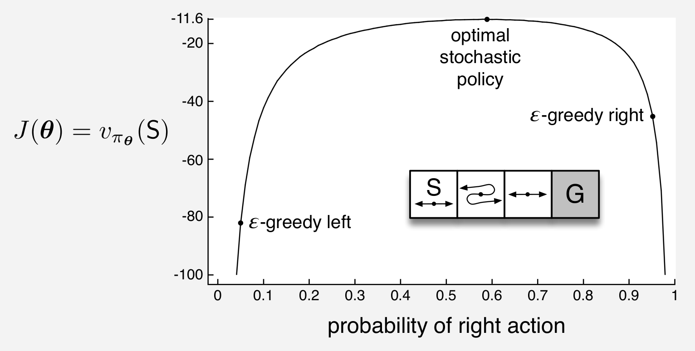
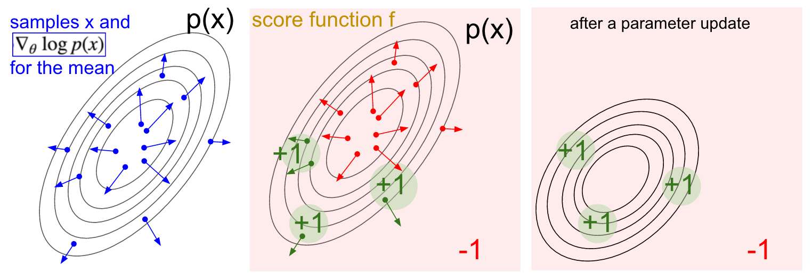

<!-- .slide: data-background="./img/blue_galactic_neural_nets.jpg" -->
<h2 class="title has-dark-background">Policy Gradient Methods</h2>

### Contents
 
 

1. Recap++
2. Motivation
3. Policy Gradient Theorem
4. Baselines
5. Actor-Critic
6. Advanced PG

### Recap
 

- We can approximate the (action-)value function:
`$$
\begin{aligned}
    V_{\theta}(s) & \approx V^{\pi}(s) \\ Q_{\theta}(s, a) & \approx Q^{\pi}(s, a)
\end{aligned}
$$`

- And then derive some policy from the learned value-function.

### VFA Objective
 

`$$
\overline{\mathrm{VE}}(\mathbf{\theta}) \doteq \sum_{s \in \mathcal{S}} \mu(s)\left[v_{\pi}(s)-\hat{v}(s, \mathbf{\theta})\right]^{2}
$$`

- minimize the good old Mean Squared Error,
- weighted by the state distribution $\mu(s)$.
- SGD will converge to a local minimum,
- Linear VFA has only one local minimum.

### Monte Carlo VFA

`$$
    \mathbf{\theta} \leftarrow 
        \mathbf{\theta}+\alpha\left[G_{t}-\hat{v}\left(S_{t}, \mathbf{\theta}\right)\right] \nabla \hat{v}\left(S_{t}, \mathbf{\theta}\right)
$$`

### One-step Temporal Difference VFA

`$$
\mathbf{\theta} \leftarrow 
    \mathbf{\theta}+\alpha\left[R+\gamma \hat{v}\left(S^{\prime}, \mathbf{\theta}\right)-\hat{v}(S, \mathbf{\theta})\right] \nabla \hat{v}(S, \mathbf{\theta})
$$`

This is not a full gradient anymore!

### Deadly triad (I)

- Function approximation
- Bootstrapping
- Off-policy training

(Sutton, 2019 [11.3])

### Deadly triad (II)

Hypothesis:
- Deep divergence
- Target networks
- Overestimation
- Multi-step
- Capacity
- Prioritization

(van Hasselt, 2018)

<!-- .slide: data-background-color="#fff" data-background="./img/landscape.png" data-background-size="40%" -->

### Reading
 
 

Sutton & Barto, 2018, [Chapter 13](http://incompleteideas.net/book/RLbook2020.pdf?p=343)

<!-- .slide: .centered .contrast data-background-color="#0f132d" -->
<h2 class="title">... is this the right objective?</h2>
 

$$\pi(s, a) = \text{Pr}(a | s, \theta)$$

 

"Do not solve a more general problem an an intermediate step. -- V. Vapnik" (via <a href="https://youtu.be/y3oqOjHiliot=22">van Hasselt</a>)

<!-- .slide: data-autoplay data-background-iframe="https://www.youtube.com/embed/kVmp0uGtShk" -->

### Motivation

- Effective in high-dimensional or continuous actions spaces
- Better convergence properties
- Easier to approximate?
- Can learn stochastic policies

(David Silver's, lecture)

#### Stochastic policies
 

<ul>
    <li>Iterated Rock-paper-scissors</li>
    <li class="fragment"> Aliased Grid-World
        
    </li>
</ul>

#### Policy Parametrizations
 

<ul>
    <li>Discrete:
        $$
            \pi(a | s, \boldsymbol{\theta}) \doteq \frac{e^{h(s, a, \boldsymbol{\theta})}}{\sum_{b} e^{h(s, b, \boldsymbol{\theta})}}
        $$
    </li>
    <li class="fragment">Continuous:
        $$
            \pi(a | s, \boldsymbol{\theta}) \doteq \mathcal{N}(\mu_{\theta}, \sigma^2_{\theta})
        $$
    </li>
</ul>

#### Objective
 

For performance measure:

`$$
    J(\boldsymbol{\theta}) \doteq v_{\pi_{\boldsymbol{\theta}}}\left(s_{0}\right),
$$`

be able to compute:

`$$
    \boldsymbol{\theta} \leftarrow \boldsymbol{\theta} + \alpha \nabla_{\theta} J(\boldsymbol{\theta}).
$$`

 For $\tau=s_0, a_0, r_1, s_1, a_1, r_2, s_2, ...$ can't we just: 
$$
    \nabla_{\theta} J\left(\pi_{\theta}\right)=\nabla_{\theta} \mathbb{E}_{\tau \sim \pi_{\theta}} \left[R(\tau) \right] \; ?
$$

### General case
 

Score function gradient estimator:

`$$
\begin{aligned}
    \nabla_{\theta} \mathbb E_{x \sim p(x \mid \theta)} [f(x)]
    &= \nabla_{\theta} \sum_x p(x \mid \theta) \; f(x) & \text{expected value} \\
    & = \sum_x \nabla_{\theta} p(x \mid \theta) \; f(x) & \\
    & = \sum_x p(x \mid \theta) \frac{\nabla_{\theta} p(x \mid \theta)}{p(x \mid \theta)} \; f(x) \\
    & = \sum_x p(x \mid \theta) \nabla_{\theta} \log p(x \mid \theta) \; f(x) & \text{because: } \nabla_{\theta} \log(z) = \frac{1}{z} \nabla_{\theta} z \\
    & = \mathbb E_x \left[ \; f(x) \nabla_{\theta} \log p(x \mid \theta) \right] & \text{take expectation}
\end{aligned}
$$`

    <small>Check out:</small> 
    <small>Mohammed, 2019. Monte-Carlo Estiation in ML</small> 
    <small>Schulman, 2015. Gradient Estimation Using Stochastic Computation Graphs</small>

### Intuition
 

<small class="cite">Karpathy, 2016</small>

### Policy Gradient Theorem (I)
 
 

`$$
\begin{aligned}
    \nabla_{\theta} J\left(\pi_{\theta}\right) & = \mathbb{E}_{\tau \sim \pi_{\theta}} \big[ R(\tau) \; \underbrace{\nabla_{\theta} \log P(\tau | \pi_{\theta})}_{??} \big]
\end{aligned}
$$`

### Policy Gradient Theorem (II)
 

$$
\begin{aligned}
\nabla_{\theta} \log P\left(\tau | \pi_{\theta}\right)
    & = \nabla_{\theta} \log \left(\mu\left(s_{0}\right) \prod_{t=0}^{T} P\left(s_{t+1} | s_{t}, a_{t}\right) \pi_{\theta}\left(a_{t} | s_{t}\right)\right) \\
    & = \nabla_{\theta}\left(\log \mu\left(s_{0}\right)+\sum_{t=0}^{T}\left(\log P\left(s_{t+1} | s_{t}, a_{t}\right)+\log \pi_{\theta}\left(a_{t} | s_{t}\right)\right)\right) \\
    & = \nabla_{\theta} \log \mu\left(s_{0}\right)+\sum_{t=0}^{T}\left(\nabla_{\theta} \log P\left(s_{t+1} | s_{t}, a_{t}\right)+\nabla_{\theta} \log \pi_{\theta}\left(a_{t} | s_{t}\right)\right) \\
    & = \color{#BD1421}{\nabla_{\theta} \log \mu\left(s_{0}\right)} + \sum_{t=0}^{T}\left(
        \color{#BD1421}{\nabla_{\theta} \log P\left(s_{t+1} | s_{t}, a_{t}\right)}
        +\nabla_{\theta} \log \pi_{\theta}\left(a_{t} | s_{t}\right)
        \right) \\
    & = \sum_{t=0}^{T} \nabla_{\theta} \log \pi_{\theta}\left(a_{t} | s_{t}\right)
\end{aligned}
$$

### Policy Gradient Theorem (III)
 
 

`$$
\begin{aligned}
    \nabla_{\theta} J\left(\pi_{\theta}\right) 
        & = \mathbb{E}_{\tau \sim \pi_{\theta}} \big[ R(\tau) \; \underbrace{\nabla_{\theta} \log P(\tau | \pi_{\theta})}_{??} \big] \\
        & = \mathbb{E}_{\tau \sim \pi_{\theta}} \left[\underbrace{R(\tau)}_{??} \sum_{t=0}^{T} \nabla_{\theta} \log \pi_{\theta}\left(a_{t} | s_{t}\right) \right] \\
        & = \mathbb{E}_{\tau \sim \pi_{\theta}} \left[\sum_{t=t^{\prime}}^T r_{t^{\prime}} \sum_{t=0}^{T} \nabla_{\theta} \log \pi_{\theta}\left(a_{t} | s_{t}\right) \right]
\end{aligned}
$$`

#### Monte-Carlo PG. Aka REINFORCE
 

`$$
    \nabla_{\theta} J(\theta) = \mathbb{E}_{\pi_{\theta}}\left[\nabla_{\theta} \log \pi_{\theta}(s, a) \; \color{#BD1421}{ G_t } \right]
$$`

 

<pre><code class="hljs" data-trim data-line-numbers="1-9">
pi(a | s, w)        # parametrized policy
alpha > 0           # step size
w = randn((D,))     # weights

# tau = trajectory s0, a0, r1, ..., s_T-1, a_T-1, r_T ~ pi
for each tau ~ pi(. | ., w):
    for each t in tau:
        G_t = sum(r_t':T)
        w += alpha * G_t * grad(log(pi(a_t | s_t, w)))
</code></pre>

#### Concrete example
 

- Consider a Gaussian policy $\pi(a | s, \boldsymbol{\theta}) \doteq \mathcal{N}(\mu_{\theta}(S_t), \sigma^2_{\theta})$
- The gradient of the log policy is then:

`$$
    \nabla_{\theta} \log \pi_{\theta}(s, a) = \frac{A_t - \mu_{\theta}(S_t)}{\sigma^2} \nabla_{\theta}(S_t)
$$`

- if the return was positive then the mean would be updated towards the action we took
- the update becomes:

`$$
    \theta_{t+1} = \theta_{t} + \alpha G_t \frac{A_t - \mu_{\theta}(S_t)}{\sigma^2} \nabla_{\theta}(S_t)
$$`

#### Baselines
 

`$$
    \nabla_{\theta} J(\theta) = \mathbb{e}_{\pi_{\theta}}\left[\nabla_{\theta} \log \pi_{\theta}(s, a) \; (G_t \color{#bd1421}{ -b(s_t) }) \right]
$$`

As long as the baseline does not depend  on $a_t$ it can be shown:

- that the estimator remains unbiased
- that it will reduce the variance of the estimator

This leads to the following update:

`$$
\theta_{t+1} = \theta_{t} + \alpha (G_t - b(S_t)) \nabla_{\theta} \log \pi_{\theta} (A_t | S_t)
$$`

#### Baselines can be unbiased
 

`$$
\begin{aligned}
    \mathbb{E}[\color{#BD1421}{b} \nabla_{\theta} \log \pi_{\theta}(S_t | A_t)]
        & = \mathbb{E} \left[ \sum_a \pi(a | S_t) \color{#BD1421}{b} \nabla_{\theta} \log \pi(a | S_t) \right] \\
        & = \mathbb{E} \left[ \color{#BD1421}{b} \nabla_{\theta} \sum_a \pi(a | S_t) \right] \\
        & = \mathbb{E} \left[ \color{#BD1421}{b} \nabla_{\theta} 1 \right] \\
        & = 0
\end{aligned}
$$`

#### Baselines for controlling variance
 

$$
\begin{align}
    {\rm Var}\left(\sum_{t=0}^{T-1}\nabla_\theta \log \pi_\theta(A_t|S_t) (R_t(\tau)-b)\right) \;
        & \overset{(i)}{\approx}\; \sum_{t=0}^{T-1} \mathbb{E}\tau\left[\Big(\nabla_\theta \log \pi_\theta(A_t|S_t) (R_t(\tau)-b)\Big)^2\right] \\
        & \overset{(ii)}{\approx}\; \sum_{t=0}^{T-1} \mathbb{E}_\tau \left[\Big(\nabla_\theta \log \pi_\theta(A_t|S_t)\Big)^2\right]\mathbb{E}_\tau\left[\Big(R_t(\tau) - b)^2\right]
\end{align}
$$

**Approximations:** i) variance of a sum ~ sum of variances, ii) independence of the terms in the expectation

Reason for choosing $b \approx \mathbb{E} [R_t(\tau)]$, as often seen in the literature
([more details](https://danieltakeshi.github.io/2017/03/28/going-deeper-into-reinforcement-learning-fundamentals-of-policy-gradients/)).

#### Baselines. Advantage Estimates
 

$$
\begin{aligned} \nabla_{\theta} J(\theta)
    \nabla_{\theta} J(\theta) 
        & = \mathbb{E}_{\pi_{\theta}}\left[\nabla_{\theta} \log \pi_{\theta}(s, a) \; (\color{#BD1421}{ Q^{\pi}_{\phi}(s, a) - V^{\pi}_{\phi}(s) }) \right] \\
        & = \mathbb{E}_{\pi_{\theta}}\left[\nabla_{\theta} \log \pi_{\theta}(s, a) \; \color{#BD1421}{ A^{\pi}_{\phi}(s, a) } \right] \\
\end{aligned}
$$

#### Advantage Estimates (II)

 N-Step Advantage Estimate:
$$
A_{t}^{\pi(n)} = 
    \underbrace{\sum_{t^{\prime}=t}^{n} \gamma^{t^{\prime}-t} r_{t^{\prime}}+\gamma^{n+1} V_{\phi}\left(s_{t+n+1}\right)}_{\approx Q^{\pi}}
    -\underbrace{V_{\phi}\left(s_{t}\right)}_{\approx V \pi}
$$

 Generalized Advantage Estimate:
$$
\begin{aligned} A_{t}^{\pi, \lambda} 
    &=(1-\lambda) \sum_{n=0}^{\infty} \lambda^{n} A_{t}^{\pi(n)} \\
    &=\sum_{t^{\prime}=t}^{\infty}(\gamma \lambda)^{t^{\prime}-t}\left(r_{t^{\prime}}+\gamma V_{\phi}\left(s_{t^{\prime}+1}\right)-V_{\phi}\left(s_{t^{\prime}}\right)\right)
\end{aligned}
$$

<!-- .slide: data-background-color="#fff" data-background-size="40%" data-background="./img/td_lambda.png" -->

##### Policy Gradient Theorem (IV)

Alternate forms:
$$
\begin{aligned} \nabla_{\theta} J(\theta)
    &=\mathbb{E}_{\pi_{\theta}}\left[\nabla_{\theta} \log \pi_{\theta}(s, a) \; \color{#BD1421}{ G_t } \right] & \text { REINFORCE } \\
    &=\mathbb{E}_{\pi_{\theta}}\left[\nabla_{\theta} \log \pi_{\theta}(s, a) \; \color{#BD1421}{ Q^{\phi}(s, a) } \right] &  \text { Q Actor-Critic } \\
    &=\mathbb{E}_{\pi_{\theta}}\left[\nabla_{\theta} \log \pi_{\theta}(s, a) \; \color{#BD1421}{ A^{\phi}(s, a) } \right] & \text { Actor-Critic } \\
    &=\mathbb{E}_{\pi_{\theta}}\left[\nabla_{\theta} \log \pi_{\theta}(s, a) \; \color{#BD1421}{ \delta } \right] &  \text { TD Actor-Critic } \\
    &=\mathbb{E}_{\pi_{\theta}}\left[\nabla_{\theta} \log \pi_{\theta}(s, a) \; \color{#BD1421}{ \delta e } \right] &  \operatorname{TD}(\lambda) \text { Actor-Critic }
\end{aligned}
$$

#### Baselines
 

### Actor-Critic methods
 

Actor-Critic methods maintain two sets (or more) of parameters:

- Critic updates (action-)value function parameters $\phi$
- Actor updates policy parameters $\theta$ in the direction suggested by the critic.

### Asynchronous Advantage Actor-Critic (A3C)
 

<ul>
    <li>Update the policy with $\nabla_{\theta^{\prime}} \log \pi\left(a_{t} | s_{t} ; \theta^{\prime}\right) A\left(s_{t}, a_{t} ; \theta, \theta_{v}\right)$...</li>
    <li>... where $A\left(s_{t}, a_{t}\right) = \sum_{i=0}^{k-1} \gamma^{i} r_{t+i}+\gamma^{k} V\left(s_{t+k} ; \theta_{v}\right)-V\left(s_{t} ; \theta_{v}\right)$.</li>
    <li>Add a regularization term $\beta \nabla_{\theta^{\prime}} H\left(\pi\left(s_{t} ; \theta^{\prime}\right)\right)$</li>
    <li>Spawn agents on multiple threads, each interacting in separate environments, all updating the same set of parameters $\theta$.</li>
</ul>

<!-- .slide: data-background-color="#fff" data-background-size="70%" data-background="./img/a3c.png" -->

<!-- .slide: data-background-color="#fff" data-background-size="70%" data-background="./img/a3c_results.png" -->

<!-- .slide: .centered data-background-color="#0f132d" -->
<h2 class="title">Advanced Policy Gradients</h2>

### Problems with PG
 

- Hard to choose stepsize
    - exacerbated by the data being nonstationary.
    - small change in parameters leads to large change in policy.
- PG methods are online, leading to worse sample efficiency 

### Optimization perspective

- In PG we optimize the loss:
`$$
L^{P G}(\theta)=\mathbb{E}_{t}\left[\log \pi_{\theta}\left(a_{t} | s_{t}\right) A_{t}\right]
$$`

- Equivalently:
`$$
L_{\theta_{\mathrm{old}}}^{I S}(\theta)=\mathbb{E}_{t}\left[\frac{\pi_{\theta}\left(a_{t} | s_{t}\right)}{\pi \theta_{\mathrm{old}}\left(a_{t} | s_{t}\right)} A_{t}\right]
$$`

- In practice this is not that different.

### Trust Region Policy Optimization

- Trust region update:
`$$
\begin{aligned}
    \text{maximize}_{\theta} & \quad L^{\text{IS}}(\theta) \\
    \text{subject to}        & \quad \mathbb{E}_t \left[\mathrm{KL}\left[\pi_{\theta_{\mathrm{old}}}\left(\cdot | s_{t}\right), \pi_{\theta}\left(\cdot | s_{t}\right)\right]\right] \leq \delta
\end{aligned}
$$`

- Efficient way to compute the gradients of these two terms which include 2nd order derivatives.

### Bring back the Experience Replay!
 

- Train the critic on off-policy data using importance sampling:
    - ACER
    - REACTOR
- Find an off-policy formulation
    - Soft Actor-Critic. Maximize the policy and its entropy.

# Questions?