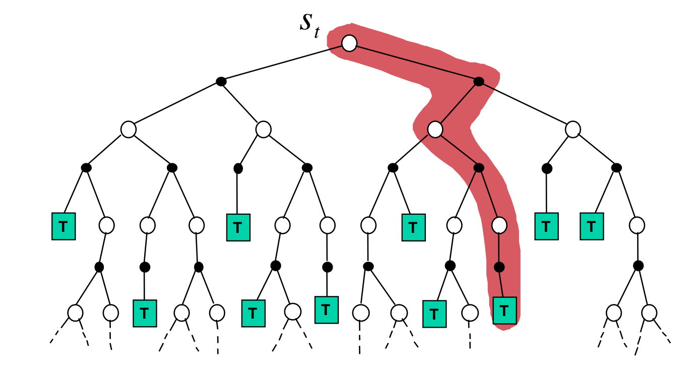

<!-- .slide: data-background-color="#0f132d" data-background="./img/blue_galactic_neural_nets.jpg" -->
<h2 class="title">Model-Based Deep Reinforcement Learning</h2>

### Further reading
 
 

This lecture draws heavily from:

- 2021 DeepMind x UCL RL Lecture Series, [lecture 8](https://www.youtube.com/playlist?list=PLqYmG7hTraZDVH599EItlEWsUOsJbAodm)
- CS285, Berkeley, Deep Reinforcement Learning, [lecture 11](https://www.youtube.com/playlist?list=PL_iWQOsE6TfXxKgI1GgyV1B_Xa0DxE5eH)

Also checkout Sutton, _Introduction to RL_, ch. 8

### Previously
 
 

1. Learn a parametrized utility function and use it to derive an $\epsilon-\text{greedy}$ policy.
2. Learn a parametrized policy directly.

 
 
 

All this without a model of the environment.

### Remember the transition dynamics?
 
 

`$$
V(s_t) =
    \sum_{a} \pi(a | s_t)
    \sum_{s^{\prime}, r} \color{#BD1421}{p\left(s^{\prime}, r | s_t, a\right)} \left[r+\gamma V\left(s^{\prime}\right)\right]
$$`

<ul>
    <li class="fragment">Known transition dynamics
        <ul>
            <li class="fragment">Games (Atari, chess, go, Crafter)</li>
            <li class="fragment">Systems that are easy to model (SpaceX rockets)</li>
            <li class="fragment">Symulated environments (robotic arms)</li>
        </ul>
    </li>
    <li class="fragment">Learn transition dynamics
        <ul>
            <li class="fragment">System identification: fit unknown parameters of a known model.</li>
            <li class="fragment">Fit a general-purpose model to observed transition data.</li>
        </ul>
    </li>
</ul>

<!-- .slide: data-background-color="#fff" data-background-size="30%" data-background="./img/model_free.png" -->

<!-- .slide: data-background-color="#fff" data-background-size="30%" data-background="./img/model_learning.png" -->

<!-- .slide: data-background-color="#fff" data-background-size="30%" data-background="./img/mixed_learning.png" -->

###  Why Model-Based RL?
 
 

<ul>
    <li>Learning transition dynamics would maybe let us reduce the no of interactions with the environment.
        <ul>
            <li class="fragment">Use the learned model to quickly learn value functions.</li>
            <li class="fragment">Use the learned model to plan better actions.</li>
            <li class="fragment">Use the learned model to plan better actions and improve your policy based on this planning.</li>
        </ul>
    </li>
    <li class="fragment">Use properties of learned models, e.g. uncertainty for exploration, safety, etc.</li>
</ul>

Potential issue: Yet another source of approximation error -- and in RL errors tend to compound quickly.

<!-- .slide: data-background-iframe="https://worldmodels.github.io/" data-background-interactive -->

### How to build a model? (I)
 

Parametrize a function $\hat{\mathbf{p}}$ with some weights $\xi$ and try to approximate the real dynamics of the environment:

$$
p(r, s' | S_t, A_t) \approx \hat{\mathbf{p}}_{\xi}(r, s' | S_t, A_t)
$$

 

The goal then is to be able to sample states according to the learned model:
$$
\hat{R}_{t+1}, \hat{S}_{t+1} = \hat{\mathbf{p}}_{\xi}(r, s' | S_t, A_t)
$$

### How to build a model? (II)
 

Collect some data and view the learning problem as a supervised one:

`$$
\mathcal{D} = \{ ((S_0, A_0): (R_1, S_1)), ((S_1, A_1): (R_2, S_2)), ((S_2, A_2): (R_3, S_3)), ... \}
$$`

Minimize some objective such as the Mean Squared Error between `$\hat{R}_{t+1}, \hat{S}_{t+1} = \hat{\mathbf{p}}_{\xi}(r, s' | S_t, A_t)$` and the labels $R_{t+1}, S_{t+1}$.

 

This gets us an expectation model. If the model is "correct" then $\hat{S}_{t+1} = \mathbb{E} \left[ S_{t+1} | s=S_t, a=A_t \right]$.

### Models can be stochastic too
 

Sometimes expectation models are not enough.

One solution is to go for stochastic (generative) models:

`$$
\hat{R}_{t+1}, \hat{S}_{t+1} \sim \hat{\mathbf{p}}_{\xi}(r, s' | S_t, A_t, \color{#BD1421}{\varepsilon})
$$`

### How to build a model? (III)
 

<ul>
    <li>Separate parametric functions for reward and transition</li>
    <li class="fragment">These functions can be:
        <ul>
            <li class="fragment">Lookup tables: count $N(s,a)$ to each state, action pair and use it to model the expected value of the reward or of the successor state.</li>
            <li class="fragment">Linear models: use a feature representation $\phi(s)$ and then parametrize separately the reward and the next state as linear functions of the features.</li>
            <li class="fragment">Deep Neural Networks.</li>
        </ul>
    </li>
</ul>

<!-- .slide: .centered data-background-color="#0f132d" -->
<h2 class="title">Planning</h2>

### What is planning?
 

Planning has different meanings in different communities. For our purposes we are interested in:

<ul>
    <li class="fragment">Planning as means of investing more computation to improve values and policies.</li>
    <li class="fragment">Planning with learned models (from experience), without access to the real dynamics.</li>
    <li class="fragment">Planning with imprecise models.</li>
</ul>

### Examples of planning?
 

Uses of a learned $\hat{\mathbf{p}}_{\xi}(r, s' | S_t, A_t)$:

<ol>
    <li class="fragment">Do dynamic programming, eg.: $V(s_t) \leftarrow \sum_{a} \pi(a | s_t) \sum_{s^{\prime}, r} p\left(s^{\prime}, r | s_t, a\right)\left[r+\gamma V\left(s^{\prime}\right)\right]$</li>
    <li class="fragment">Open-loop planning: given a state, commit to a sequence of actions.</li>
    <li class="fragment">Closed-loop planning: at each step in the environment use the learned model to infer the best policy, for example by doing Monte-Carlo rollouts or search.</li>
    <li class="fragment">Sample-based planning: use the model to sample $S_{t}, R_{t}$ and use the extra data to further train your model-free agent.</li>
</ol>

### Challenges of learned models
 

Most of the times the working assumption should be that $p \neq \hat{\mathbf{p}}_{\xi}$. Consequences:

<ul>
    <li class="fragment">Values and policies might be suboptimal.</li>
    <li class="fragment">Performance is limited to the optimal policy for the approximate $\mathcal{M} = \langle\mathcal{S}, \mathcal{A}, \hat{\mathbf{p}}_{\xi}\rangle$.</li>
    <li class="fragment">Model-based RL is only as good as the estimated model.</li>
</ul>

<!-- .slide: data-background-color="#fff" -->
### Sample-based planning: Dyna-Q (I)
 

Two sources of experience: real $R_t, S_t \sim p$ and simulated $R_t, S_t \sim \hat{\mathbf{p}}_{\xi}$.

Use both sources for model-free learning.

<!-- .slide: data-background-color="#fff" -->
### Sample-based planning: Dyna-Q (II)
 

<!-- .slide: data-background-color="#fff" data-background-size="60%" data-background="./img/dyna_q_setup.png" -->

<!-- .slide: data-background-color="#fff" data-background-size="60%" data-background="./img/dyna_q_comp.png" -->

<!-- .slide: data-background-color="#fff" data-background-size="40%" data-background="./img/dyna_q_harder.png" -->

<!-- .slide: data-background-color="#fff" data-background-size="30%" data-background="./img/dyna_q_easier.png" -->

<!-- .slide: .centered data-background-color="#0f132d" -->
<h2 class="title">Planning recipes</h2>

### Planning v0.5
 
 

<ol>
    <li class="fragment">run base policy $\pi_0(a_t | s_t)$ and collect $\mathcal{D} = \{(s, a, s')_i\}$</li>
    <li class="fragment">learn the dynamics model $\hat{\mathbf{p}}_{\xi}(s' | s, s)$ to minimize $\sum_i \lVert \hat{\mathbf{p}}_{\xi}(s' | s, a) - s_{i}' \rVert ^2$</li>
    <li class="fragment">plan through $\pi_0(a_t | s_t)$ to choose actions</li>
</ol>

 
 
 
 

This works well in system identification, when we can use prior knowledge to hand-engineer the dynamics and then fit a few parameters.

<!-- .slide: data-background-color="#fff" -->
### Planning v0.5 - Fail
 

Distribution mismatch $p_{\pi_{\text{model}}}(s_t) \neq p_{\pi_0}(s_t)$. It gets exacerbated by large non-liniar models such as deep neural networks.

### Planning v1.0
 
 

Goal: we need to make $p_{\pi_{\text{model}}}(s_t) \approx p_{\pi_0}(s_t)$

 
<ol>
    <li class="fragment">run base policy $\pi_0(a_t | s_t)$ and collect $\mathcal{D} = \{(s, a, s')_i\}$</li>
    <li class="fragment">learn the dynamics model $\hat{\mathbf{p}}_{\xi}(s' | s, s)$ to minimize $\sum_i \lVert \hat{\mathbf{p}}_{\xi}(s' | s, a) - s_{i}' \rVert ^2$</li>
    <li class="fragment">plan through $\pi_0(a_t | s_t)$ to choose actions</li>
    <li class="fragment">execute the actions and add the resulting data $\{(s, a, s')_i\}$ to $\mathcal{D}$</li>
    <li class="fragment">go to (2)</li>
</ol>

<!-- .slide: data-background-color="#fff" -->
### Planning v1.0 - can we do better
 
 

### Planning v1.5 or Model Predictive Control
 
 

Goal: we need to make $p_{\pi_{\text{model}}}(s_t) \approx p_{\pi_0}(s_t)$

 
<ol>
    <li class="fragment">run base policy $\pi_0(a_t | s_t)$ and collect $\mathcal{D} = \{(s, a, s')_i\}$</li>
    <li class="fragment">Learn the dynamics model $\hat{\mathbf{p}}_{\xi}(s' | s, s)$ to minimize $\sum_i \lVert \hat{\mathbf{p}}_{\xi}(s' | s, a) - s_{i}' \rVert ^2$</li>
    <li class="fragment">plan through $\pi_0(a_t | s_t)$ to choose actions</li>
    <li class="fragment">execute the first planned actions, observe $s'$
    <li class="fragment">append $\{(s, a, s')_i\}$ to $\mathcal{D}$</li>
    <li class="fragment">go to (3) or every N steps go to (2)</li>
</ol>

### Planning v1.5 or Model Predictive Control
 
 

<ul>
    <li>The more you replan, the less perfect each individual plan needs to be</li>
    <li class="fragment">Can use shorter horizons</li>
    <li class="fragment">Even random sampling can often work well here!</li>
</ul>

<!-- .slide: .centered data-background-color="#0f132d" -->
<h2 class="title">Wait, all this model-based stuff sounds familiar...</h2>

### Let's look at the distinction once more
 
 

Model-free methods update the value function and/or policy and do not have explicit dynamics models.
 
 
Model-based methods update the transition and reward models, and compute a value function or policy from the model.

### What about Experience Replay?
 
 

<ul>
    <li>Deep Q-Networks and Soft Actor-Critic (and others) also store transitions in a replay buffer.</li>
    <li class="fragment">Data is sampled from the buffer and we perform model-free RL</li>
    <li class="fragment">But this sounds like Dyna, with a few distinctions:
        <ul>
            <li class="fragment">in DQN we sample full transitions $\langle s, a, r, s' \rangle$</li>
            <li class="fragment">whereas in Dyna we only sample $\langle s, a \rangle$ and then infer $\langle r, s' \rangle$ from the model</li>
            <li class="fragment">we can still trade-off computation and sample complexity (relevant for your assignment also!)</li>
        </ul>
    </li>
</ul>

### What about Experience Replay?
 

<ul>
    <li class="fragment">For tabular RL the equivalence between model-free RL and some model-based methods can be exact. In practice models are not perfect.</li>
    <li class="fragment">A model however can be much more: query for action that you could take in the future, you could have taken in the past, etc.</li>
    <li class="fragment">Models also can have some computational advantages.</li>
</ul>

<!-- .slide: .centered data-background-color="#0f132d" -->
<h2 class="title">Planning for action selection</h2>

<!-- .slide: data-background-color="#fff" -->
### Forward search
 

- Select the best action by lookahead
- Build a search tree with the current state at the root and use the learned model to expand it.
- Expensive, errors have a tendency to be cummulative.

<!-- .slide: data-background-color="#fff" -->
### Simulation-based search

- Sample-based variant of Forward Search
- Simulate episodes of experiences from the current state and compute:

`$$
\begin{aligned}
    V(S_t)      & = \frac{1}{K} \sum_{k=1}^{K} G_t^k \rightsquigarrow V^{\pi}(s) \\
    Q(S_t, A_t) & = \frac{1}{K} \sum_{k=1}^{K} G_t^k \rightsquigarrow Q^{\pi}(s, a) \\
\end{aligned}
$$`

### Monte-Carlo Tree Search

In MCTS, we incrementally build a search tree containing visited states and actions, together with estimated action values $Q(S_t,A_t)$ for each of these pairs.

<ul>
    <li class="fragment">Repeat (for each simulated episode)
    <ul>
        <li class="fragment">Select until you reach a leaf node of the tree, pick actions according to $Q(s ,a)$.</li>
        <li class="fragment">Expand search tree by one node</li>
        <li class="fragment">Rollout until episode termination with a fixed simulation policy</li>
        <li class="fragment">Update action-values $Q(S_t,A_t)$ for all state-action pairs in the tree
        $$
            Q(S_t, A_t) =
                \frac{1}{N(s,a)}
                \sum_{k=1}^{K}
                \sum_{u=t}^{T}
                \mathcal{1}(S_u^k,A_u^k = s,a) G_u^k \rightsquigarrow Q^{\pi}(s, a)
        $$
        </li>
    </ul>
    </li>
    <li class="fragment">Output best action according to $Q(s_t, a_t)$ in the root node when time runs out.</li>
</ul>

<!-- .slide: .centered data-background-color="#0f132d" -->
<h2 class="title">Putting it all together</h2>
