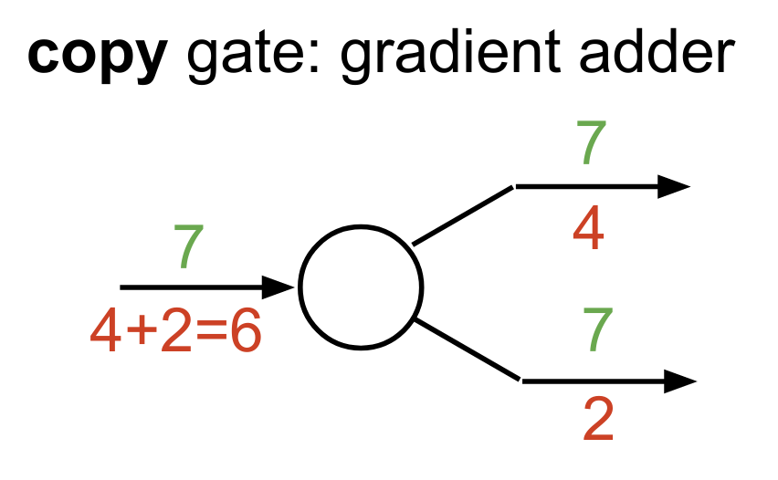

<!-- .slide: data-background-color="#F0F0F0" data-background="./img/hero.png" data-background-size="60%" data-background-position="bottom right" -->
<h2 class="title">Optimization for DNNs</h2>

<!-- .slide: data-background-color="#F0F0F0" data-background="./img/course_map.png" -->

### Contents
 

1. Recap++
2. Gradient descent
3. Problems with (S)GD
4. Advanced optimization methods

### Recap. Linear models
 

Find the weights either analytically or iteratively.

<!-- .slide: data-background-iframe="http://vision.stanford.edu/teaching/cs231n-demos/linear-classify/" data-background-interactive -->

### Recap. Transformations
 

<ul>
    <li><code>$\bm{y} = \bm{W}\bm{x}$</code> computes 
        rotation, 
        scale and 
        reflection transforms,
    </li>
    <li><code>$\sigma(\bm{W}\bm{x})$</code> adds non-linear transforms</li>
</ul>

    
    

### Recap. Fully connected NN

- Linear case: <code>$f(\bm{x}) = \bm{W}\bm{x}$</code>
- Neural net: <code>$f(\bm{x}) = \bm{W}_3\sigma(\bm{W}_2 \sigma(\bm{W}_1\bm{x}))$</code>

### Recap. Fully connected NN

- Neural net:    <code>$f(\bm{x}) = \bm{y} = \bm{W}_2 \sigma(\bm{W}_1\bm{x} + \bm{b}_1) + \bm{b}_2$</code>
<!-- - Loss function: <code>$\mathcal{L}(\bm{W}) = \sum_{i=0}^N (y_i - t_i)^2$</code> -->
- Loss function: <code>$\mathcal{L} = \frac{\bm{y} \cdot \bm{t}}{\lVert \bm{y} \rVert \lVert \bm{t} \rVert}$</code>

### Recap. Computation graphs & AD

Automatic Differentiation: takes a program which
computes a value, and automatically constructs a procedure for computing
derivatives of that value with respect to some inputs.

Grosse, Ba, CS421

### Recap. Backpropagation

Fei-Fei et. al, CS231n

### Recap. Backprop patterns

    

    

    

    

### Recap. Backprop beyond scalars
 

<ul>
    <li>scalar to scalar: $x \in \mathbb{R}, y \in \mathbb{R}$. Derivative: $\frac{\partial y}{\partial x} \in \mathbb{R}$</li>
    <li class="fragment">vector to scalar: $\bm{x} \in \mathbb{R}^N, y \in \mathbb{R}$. 
        <strong>Gradient</strong>: $\frac{\partial y}{\partial \bm{x}} \in \mathbb{R}^N$
    </li>
    <li class="fragment">vector to vector: $\bm{x} \in \mathbb{R}^N, \bm{y} \in \mathbb{R}^M$.
        <strong>Jacobian</strong>: $\frac{\partial \bm{y}}{\partial \bm{x}} \in \mathbb{R}^{N \times M}$
    </li>
</ul>

### Recap. Some other points
 

<ul>
    <li>Can we compute $\frac{\partial y}{\partial x} \in \mathbb{R}$ with $y \sim \mathcal{N}(0, x)$?</li>
    
(yes, sort of, check <a href="https://arxiv.org/abs/1906.10652">Mohamed, 2019</a>)

    <li class="fragment">While depth is good, it can be problematic</li>
    <li class="fragment">Initialization matters!</li>
    <li class="fragment">Also, Universal Approximation Theorem does not imply every function is also learnable!</li>
</ul>

<!-- .slide: .centered data-background-color="#0f132d" -->
<h2 class="title">Optimization</h2>

### Gradient Descent
 

    

        <ul>
            <li>Measure the error of our model using $\mathcal{L}(\mathcal{D}, \bm{\theta})$,</li>
            <li>Compute the gradients w.r.t. $\theta$,</li>
            <li>Find incremental solutions that better explain the data using:</li>
        </ul>
        

        $$\bm{\theta}_{j+1} \leftarrow \bm{\theta}_j - \eta \nabla_{\bm{\theta}_j}\mathcal{L}$$
        

    

    

### Stochastic Gradient Descent
 

Consider instead objective functions that are the sum of the losses -- $\mathcal{L}(\bm{\theta}) = \sum_{n=1}^{N}\mathcal{L}_n(\bm{\theta})$, resulting in the update:

$$\bm{\theta}_{j+1} \leftarrow \bm{\theta}_j - \eta \sum_{n=1}^{N} \nabla_{\bm{\theta}_j}\mathcal{L}_n(\bm{\theta})$$

 
<ul>
    <li class="fragment">evaluating the sum of gradients can be expensive</li>
    <li class="fragment">instead we can randomly choose a subset of $\mathcal{L}_n$</li>
    <li class="fragment">for gradient descent to converge we only require the samples to be unbiased</li>
</ul>

<!-- .slide: data-background-color="#F0F0F0" data-background="./img/landscapes.png" data-background-size="80%" -->

### Taylor Approximation
 

- Arbitrary non-linear functions are hard to globally analyze.
- Ideally, we would like to work with simple functions: polynomials.
- Solution: get a polynomial that approximates the
function in a neighbourhood well enough

 
 

$$
\mathcal{L}(\bm{\theta}) \approx
    \mathcal{L}\left(\bm{\theta}_{0}\right)+
    \nabla \mathcal{L}\left(\bm{\theta}_{0}\right)^{\top}\left(\bm{\theta}-\bm{\theta}_{0}\right)+
    \frac{1}{2}\left(\bm{\theta}-\bm{\theta}_{0}\right)^{\top} \mathbf{H}\left(\bm{\theta}_{0}\right)\left(\bm{\theta}-\bm{\theta}_{0}\right)
$$

### Taylor Approximation
 

$\text{sin}(x)$ and its Taylor approximations, polynomials of degree
1,
3,
5,
7,
9,
11, and
13.
By <a href="https://commons.wikimedia.org/w/index.php?curid=27865201">IkamusumeFan, CC BY-SA 3.0</a>.

### First-Order

    
    

Growth of a function when a) changing $\theta$ and b) moving in the direction of $\theta - \theta_0$.

$$
\mathcal{L}(\bm{\theta}) \approx
    \mathcal{L}\left(\bm{\theta}_{0}\right)+
    \nabla \mathcal{L}\left(\bm{\theta}_{0}\right)^{\top}\left(\bm{\theta}-\bm{\theta}_{0}\right)
$$

### Critical points
 

$$
\mathcal{L}(\bm{\theta}) \approx
    \mathcal{L}\left(\bm{\theta}_{0}\right)+
    \frac{1}{2}\left(\bm{\theta}-\bm{\theta}_{0}\right)^{\top} \mathbf{H}\left(\bm{\theta}_{0}\right)\left(\bm{\theta}-\bm{\theta}_{0}\right)
$$

How does moving in a direction affect the rate of change.

### Patologies. Plateaux

    
    

<ul>
    <li>In cases where a neuron is saturated:
         $\delta_{\bm{\theta}} = \delta_{\bm{z}} \bm{x}$,
         $\delta_{\bm{z}} =\delta_{\bm{h}} \frac{\partial\bm{h}}{\partial \bm{z}} = \delta_{\bm{h}} \phi^{\prime}(\bm{z})$.</li>
    <li class="fragment"> Solutions: use ReLU activations and good initialization schemes.</li>
</ul>

### Patologies. Bad curvature

    
    

Remeber: $\bm{\theta}_{j+1} \leftarrow \bm{\theta}_j - \alpha \nabla_{\bm{\theta}_j}\mathcal{L}$

Badly conditioned curvatures arise even in simple cases, when the inputs have
slightly different scales or are off-centered. 

Solutions: i) standardize your input data, ii)
normalize every pre-activation.

<!-- .slide: data-background-iframe="https://distill.pub/2017/momentum/" data-background-interactive -->

### Closed-form GD update
 

Consider the objective: 

$\mathcal{L}(\bm{\theta}) = \frac{1}{2} \bm{\theta}^{\intercal}\underbrace{(\bm{X}^{\intercal}\bm{X})}_{\bm{A}}\bm{\theta}$,

Write the gradient descent update as:

$$\begin{aligned}
\bm{\theta}_{t+1} & \leftarrow \bm{\theta}_{t}-\alpha \nabla \mathcal{L}\left(\bm{\theta}_{t}\right) \\
&=\bm{\theta}_{t}-\alpha \mathbf{A} \bm{\theta}_{t} \\
&=(\mathbf{I}-\alpha \mathbf{A}) \bm{\theta}_{t}
\end{aligned}$$

Breaking the recursion:

$$
    \bm{\theta}_t = (\mathbf{I} - \alpha \mathbf{A})^{t} \bm{\theta}_0.
$$

### Component-wise

Spectral decomposition: $\mathbf{A} = \mathbf{Q}\mathbf{\Lambda}\mathbf{Q}^{\intercal}$ so that we can do a change of basis:

$$
\begin{aligned}
(\mathbf{I}-\alpha \mathbf{A})^{t} \bm{\theta}_{0} &=\left(\mathbf{I}-\alpha \mathbf{Q} \mathbf{\Lambda} \mathbf{Q}^{\top}\right)^{t} \bm{\theta}_{0} \\
&=\left[\mathbf{Q}(\mathbf{I}-\alpha \bm{\Lambda}) \mathbf{Q}^{\top}\right]^{t} \bm{\theta}_{0} \\
&=\mathbf{Q}(\mathbf{I}-\alpha \bm{\Lambda})^{t} \mathbf{Q}^{\top} \bm{\theta}_{0}
\end{aligned}
$$

In the eigenspace of $\mathbf{Q}$, each coordinate is multiplied by $(1 - \alpha \lambda_i)^{t}$

Behaviours:

- $0 \lt \alpha\lambda_i \leq 1$: decays to 0 at a rate depending on $\lambda_i$
- $1 \lt \alpha\lambda_i \leq 2$: oscillations
- $\alpha \lambda_i \gt 2$: diverges

### Learning dynamics

The optimizer is quickly descending along the direction of the largest eigenvalues.

### Fix #1. Momentum
 

Plain gradient descent:

$$\bm{\theta}_{t+1} \leftarrow \bm{\theta}_t - \alpha \nabla_{\bm{\theta}_t}\mathcal{L}$$

With momentum:

$$\begin{aligned}
\bm{v}_{t+1} &\leftarrow \mu \bm{v}_t + \nabla_{\bm{\theta}_t}\mathcal{L}\\
\bm{\theta}_{t+1} &\leftarrow \bm{\theta}_t - \alpha \bm{v}_{t+1}.
\end{aligned}$$

- $\mu$: damping factor and controls _how much momentum_ we use.
- Rolling ball on a slope analogy.
- Keeps the _historic_ direction in low curvature regions and _dampens_ oscillations in high curvature directions.

<!-- .slide: data-background-iframe="https://distill.pub/2017/momentum/" data-background-interactive -->

### Fix #1. Momentum
 

- no reason not to use it, it almost always helps...
- ...except when modelling distributions and small changes in $\theta$ means a large change in the distribution,
- low memory complexity,
- also check Nesterov momentum.

### Fix #2. RMSprop
 

Plain gradient descent:

$$\bm{\theta}_{t+1} \leftarrow \bm{\theta}_t - \alpha \nabla_{\bm{\theta}_t}\mathcal{L}$$

With RMSprop:

$$\begin{aligned}
    \bm{s}_t &\leftarrow (1 - \gamma) \bm{s}_t + \gamma [\nabla_{\bm{\theta}_t}\mathcal{L}]^{2}, \\
    \bm{\theta}_{t+1} &\leftarrow \bm{\theta}_t - \frac{\alpha}{\sqrt{\bm{s}_t + \epsilon}} \nabla_{\bm{\theta}_t}\mathcal{L}.
\end{aligned}$$

- adaptive learning rate!
- small components will use a higher step size
- alternate view: the gradient is rescaled to have norm 1

### Fix #3. Adam

Bring back momentum!

$$\begin{aligned}
\bm{v}_{t} &\leftarrow \mu \bm{v}_{t-1} + (1-\alpha) \nabla_{\bm{\theta}_t}\mathcal{L}\\
\bm{s}_t   &\leftarrow \gamma \bm{s}_{t-1} + (1 - \gamma) [\nabla_{\bm{\theta}_t}\mathcal{L}]^{2}, \\
\end{aligned}$$

The parameter update is then:

$$
\bm{\theta}_{t+1} \leftarrow \bm{\theta}_t - \frac{\alpha}{\sqrt{\bm{s}_t + \epsilon}} \bm{v}_t.
$$

### Comparison

    
    

### Regularization

<!-- .slide: .centered data-background-color="#0f132d" -->
# Questions?