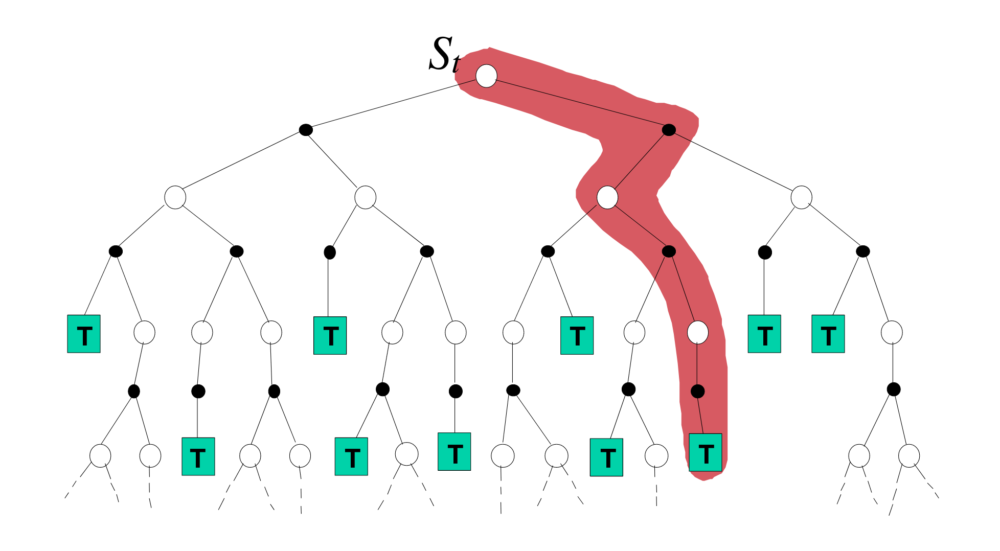

<!-- .slide: data-background="./img/blue_galactic_neural_nets.jpg" -->
<h2 class="title has-dark-background">Deep Q Networks</h2>

<!-- .slide: data-background-iframe="https://spinningup.openai.com/en/latest/spinningup/keypapers.html" data-background-interactive -->

<!-- .slide: data-background="./img/covers.png" data-background-size="50%" -->

<!-- .slide: data-background-color="#fff" data-background="./img/alpha_go.png" data-background-size="30%" -->

<!-- .slide: data-background-color="#fff" data-background="./img/td_gammon.png" data-background-size="50%" -->

<!-- .slide: data-background-color="#fff" data-background="./img/open_ended_world.png" data-background-size="70%" -->

<h3>How about Deep RL in the Real Life</h3>
 
 

- [Online advertising](https://vowpalwabbit.org/)
- Dialogue systems
- [Project Loon](https://blog.x.company/drifting-efficiently-through-the-stratosphere-using-deep-reinforcement-learning-c38723ee2e90)
- [Target COVID testing of travellers](https://www.nature.com/articles/d41586-021-02556-w)
- Data center energy optimization
- [RL for Real Life ICML workshop](https://sites.google.com/view/RL4RealLife#h.p_E8GavvJ-X7nT)
- Robotics

### Notation
 
 

- Reward $R_t$. Scalar signal, performance at step $t$.
- Action $A_t$. Action taken by the agent according to:
    - Deterministic policy $a_t = \pi(s_t)$.
    - Stochastic policy $a_t \sim \pi(a_t | s_t)$.
- Observation $O_t.$ High-dimensional vector, different from the environment state.
- State $S_t$. Internal state of the environment.

<!-- .slide: data-background-color="#fff" data-background="./img/action_perception_loop.png" data-background-size="70%" -->

### Return
 
 

Return: $G_t = R_{t+1} + R_{t+2} + R_{t+3} ... $

 
Discounted return:

$$G_t = R_{t+1} + \gamma R_{t+2} + \gamma^2 R_{t+3} + ...$$

 

Recursive: $G_t = R_{t+1} + \gamma G_{t+1}$

###  Value functions
 

How good is a state? Or an action in a state?

 

`$$
\begin{align}
    Q^{\pi}(s_t, a_t)
    &= \mathbb{E}_{\pi, P} \left[ G_t \,\vert\, S_t=s, A_t=a \right] \\
    &= \mathbb{E}_{\pi, P} \left[
    R_{t+1} + \gamma R_{t+2} + \gamma^{2} R_{t+3} ... + \gamma^{T-1} R_{T} \,\vert\, S_t=s, A_t = a
    \right]\\
    V^{\pi}(s_t)
    &= \mathbb{E}_{a \sim \pi} \left[ Q_{\pi}(s_t, a_t) \right]
\end{align}
$$`

### Bellman equations
 
 

$Q^{\pi}(s_t, a_t)$ supports a recursive formulation:

`$$
\begin{align}
Q^{\pi}(s_t, a_t) 
    &= \mathbb{E}_{\pi, P} \left[
    R_{t+1} + \gamma R_{t+2} + \gamma^{2} R_{t+3} ... + \gamma^{T-1} R_{T} \,\vert\, S_t=s, A_t=a 
    \right] \\
    &= \mathbb{E}_{\pi, P} \left[
    R_{t+1} + \gamma Q^{\pi}(S_{t+1}, A_{t+1}) \,\vert\, S_t=s, A_t=a
    \right]
\end{align}
$$`

 
 

And a similar form holds for optimal actions, leading to the Bellman equation:

`$$
\begin{align}
\pi^*(s) &= \arg\max_a Q(s,a)\\
Q^{\pi}(s_t, a_t) &= \mathbb{E}_{\pi, P} \left[
    R_{t+1} + \gamma Q^{\pi}\left(S_{t+1}, \pi^{\ast}(S_{t+1})\right) \,\vert\, S_t=s
    \right]
\end{align}
$$`

### Dynamic Programming

`$$
V(s_t) \leftarrow \sum_{a} \pi(a | s_t) \sum_{s^{\prime}, r} p\left(s^{\prime}, r | s_t, a\right)\left[r+\gamma V\left(s^{\prime}\right)\right]
$$`

### Monte Carlo

`$$
V(s_t) \leftarrow V(s_t) + \alpha[G_t - V(s_t)]
$$`

### One-step Temporal Difference or TD(0)

`$$
V(s_t) \leftarrow V(s_t) + \alpha[r_{t+1} + \gamma V(s_{t+1}) - V(s_t)]
$$`

### Unified View
 

<!-- .slide: .centered data-background-color="#0f132d" -->
<h2 class="title">TD(0) methods for control</h2>

### On-Policy Control
 
 

SARSA update:

$$
Q\left(S_{t}, A_{t}\right) \leftarrow Q\left(S_{t}, A_{t}\right)+\alpha\left[R_{t+1}+\gamma Q\left(S_{t+1}, A_{t+1}\right)-Q\left(S_{t}, A_{t}\right)\right]
$$

### Off-Policy Control
 
 

Q-learning update:

$$
Q(s_t, a_t) \leftarrow
    Q(s_t, a_t) + \alpha[R_{t+1} + \gamma \mathop{\max}\limits_{a} Q(s_{t+1}, a) - Q(s_t, a_t)]
$$

<!-- .slide: .centered data-background-color="#0f132d" -->
<h2 class="title">So, is RL done?</h2>

<!-- .slide: .centered data-background-color="#0f132d" -->
<h2 class="title">Value Function Approximation</h2>

### Value Function Approximation Objective
 
 

`$$
\overline{\mathrm{VE}}(\mathbf{w}) \doteq \sum_{s \in \mathcal{S}} \mu(s)\left[v_{\pi}(s)-\hat{v}(s, \mathbf{w})\right]^{2}
$$`

- minimize the good old Mean Squared Error,
- weighted by the state distribution $\mu(s)$.
- SGD will converge to a local minimum,
- Linear VFA has only one local minimum.

### Stochastic Gradient Descent
 
 

`$$
\begin{aligned}
    \mathbf{w}_{t+1}
        & \doteq \mathbf{w}_{t}-\frac{1}{2} \alpha \nabla\left[v_{\pi}\left(S_{t}\right)-\hat{v}\left(S_{t}, \mathbf{w}_{t}\right)\right]^{2} \\
        &=\mathbf{w}_{t}+\alpha\left[v_{\pi}\left(S_{t}\right)-\hat{v}\left(S_{t}, \mathbf{w}_{t}\right)\right] \nabla \hat{v}\left(S_{t}, \mathbf{w}_{t}\right)
    \end{aligned}
$$`

This is guaranteed to converge as $\alpha \rightarrow 0$. 

But we generaly don't know $v_{\pi}(S_{t})$!

### Monte Carlo VFA

`$$
    \mathbf{w} \leftarrow \mathbf{w}+\alpha\left[G_{t}-\hat{v}\left(S_{t}, \mathbf{w}\right)\right] \nabla \hat{v}\left(S_{t}, \mathbf{w}\right)
$$`

### One-step Temporal Difference VFA

`$$
\mathbf{w} \leftarrow \mathbf{w}+\alpha\left[R+\gamma \hat{v}\left(S^{\prime}, \mathbf{w}\right)-\hat{v}(S, \mathbf{w})\right] \nabla \hat{v}(S, \mathbf{w})
$$`

This is not a full (true) gradient anymore!

### Semi-Gradient Methods
 
 

$$
\mathbf{w} \leftarrow \mathbf{w}+\alpha\left[U_t-\hat{v}(S, \mathbf{w})\right] \nabla \hat{v}(S, \mathbf{w})
$$

- If $U_t$ is an unbiased estimate of $v^{\pi}(S_t)$, such as $G_t$, all good!

- When bootstrapping however: $U_t = R+\gamma \hat{v}\left(S^{\prime}, \mathbf{w}\right)$
    - the true gradient update is: $\mathbf{w} \leftarrow \mathbf{w}+\alpha\left[U_t-\hat{v}(S, \mathbf{w})\right] (\nabla \hat{v}(S, \mathbf{w}) - \gamma \nabla \hat{v}(S_{t+1}, \mathbf{w}))$.
    - the target depends on the current $\mathbf{w}$.

 

Semi-gradient takes into account the effect of changing $\mathbf{w}$ on the estimate but ignore its effect on the target.

### Before NN Approximators
 
 

Take a linear approximator:

`$$
\hat{v}(s, \mathbf{w}) \doteq \mathbf{w}^{\top} \Phi(s) \doteq \sum_{i=1}^{d} w_{i} \phi_{i}(s)
$$`

and compose it with some non-linear feature extractor $\Phi(s)$.

How about convergence? Gordon, 1999, shows Watkins & Dayan's results holds only for certain $\Phi(s)$.

### Coarse coding example
 
 

<!-- .slide: .centered data-background-color="#0f132d" -->
<h2 class="title">... Needs more layers</h2>

### Neural Fitted Q-Learning
 

- Dataset $\mathcal{D} = \{<s, a, r, s^{\ast}>\}$
- Build target: $Y_k^{Q} = r + \gamma \max_{a^{\ast}} Q(s^{\ast}, a^{\ast}; \theta_k)$

Minimize the loss:
`$$
\mathcal{L}_{\text{NFQ}} = \left[Q(s, a; \theta_k) - Y^{Q}_k \right]^2
$$`

Problem: Updating $\theta$ also updates the target.

### Deep Q-networks (I)
 
 

 

$$
\mathcal{L}_{\text{DQN}}(\boldsymbol{\theta})=\mathbb{E}_{\left(s, a, r, s^{\prime}\right) \sim U(\mathcal{D})}
    \big[\underbrace{r+\gamma \max _{a^{\prime}} Q\left(s^{\prime}, a^{\prime} ; \boldsymbol{\theta}^{-}\right)}_{\text {refined estimate }}-\underbrace{Q(s, a ; \boldsymbol{\theta})}_{\text {current estimate }})^{2}\big]
$$

### Deep Q-networks (II)
 
 

- uses convolutional neural networks to learn directly from pixels
- introduces a separate target network
- adapts Experience Replay  from (Lin, 1992)
- stacks the last four frames to provide a "history" or a context.
- networks use ReLU activations
- optimized with RMSprop

Huge leap over previous linear estimators with handcrafted feature extractors.

<!-- .slide: data-background-color="#0f132d" data-background="./img/atari_domain.png" data-background-size="50%" -->

<!-- .slide: data-background-color="#fff" data-background="./img/dqn_performance.png" data-background-size="50%" -->

### Deep Q-networks (III)
 
 

- input is a stack of four grayscale frames
- network consists of three convolutional layers,
- one hidden fully connected layer
- and one output fully connected layer layer
- ReLU activation functions in-between

### Deep Q-networks (IV). Convolutions
 
 

### Deep Q-networks (IV). Convolutions
 
 

<!-- .slide: data-background-color="#fff" data-background="./img/atari_representations.png" data-background-size="50%" -->

### Deep Q-networks (IV). Algorithm
 

### Deep Q-networks (V)
 
 

 

$$
\mathcal{L}_{\text{DQN}}(\boldsymbol{\theta})=\mathbb{E}_{\left(s, a, r, s^{\prime}\right) \sim U(\mathcal{D})}
    \big[\underbrace{r+\gamma \max _{a^{\prime}} Q\left(s^{\prime}, a^{\prime} ; \boldsymbol{\theta}^{-}\right)}_{\text {refined estimate }}-\underbrace{Q(s, a ; \boldsymbol{\theta})}_{\text {current estimate }})^{2}\big]
$$

### Action Overestimation
 
 

- random estimation errors
- the approximator is not expressible
- non-stationarity of the data
- the $\texttt{max}$ operator is positively biased

### Maximization bias (I)
 
 

Suppose $Q(s, a; \theta) + \epsilon$ with $\mu=0$:

the target can be overestimated up to

`$$
    \gamma\epsilon\frac{m-1}{m+1}
$$`

### Maximization bias (II)
 
 

 
Even in tabular settings!

### Double Q-learning
 
 

- Set two estimates, $Q_1(a), Q_2(a)$ and use them to:
    - determine the maximizing action $A^{\ast} = \text{argmax}_{a} Q_1(a)$,
    - estimate its value $Q_2(A^{\ast}) = Q_2(\text{argmax}_{a} Q_1(a))$,
    - then randomly switch roles.

- In Double _Deep_ Q-Networks however:

`$$
Y_{k}^{D D Q N}=r+\gamma Q\left(s^{\prime}, \underset{a \in \mathcal{A}}{\operatorname{argmax}} Q\left(s^{\prime}, a ; \theta_{k}\right) ; \theta_{k}^{-}\right)
$$`

<!-- .slide: data-background-color="#fff" data-background="./img/ddqn_results.png" data-background-size="60%" -->

### Dueling DQN (I)
 
 

- from the definition:

`$$
    V^{\pi}(s) = \mathbb E_{a \sim \pi(s)} \,[Q^{\pi}(s,a)]
$$`

- derive the advantage some action has with respect to $V(s)$

`$$
    A^{\pi}(s,a) = Q^{\pi}(s,a) - V^{\pi}(s)
$$`

- that is, for optimal action $a^{\ast}$: $A^{\pi}(s, a^{\ast}) = 0$

### Dueling DQN (II)
 
 

- Naively:
`$$
    Q(s,a; \theta, \alpha, \beta) = V(s;\theta, \beta) + A(s,a;\theta, \alpha)
$$`

### Dueling DQN (III)
 
 

- However we can't recover unique V and A so we force $A(s, a) = 0$ for the action taken:

`$$
\begin{aligned}
    Q(s,a; \theta, \alpha, \beta) = & V(s;\theta, \beta) \\
        & + (A(s,a;\theta, \alpha) - \mathop{\max}\limits_{a'\in |\mathcal A|} A(s,a';\theta, \alpha))
\end{aligned}
$$`

 - In practice:

`$$
\begin{aligned}
 Q(s,a; \theta, \alpha, \beta) = & V(s;\theta, \beta) \\
        & + (A(s,a;\theta, \alpha) - \frac{1}{|\mathcal A|}\Sigma_{a'}A(s,a';\theta, \alpha))
\end{aligned}
$$`

<!-- .slide: data-background-color="#fff" data-background="./img/dueling_saliency.png" data-background-size="40%" -->

### Auxiliary Tasks

<!-- .slide: data-background-iframe="https://worldmodels.github.io/" data-background-interactive -->

# Questions?
