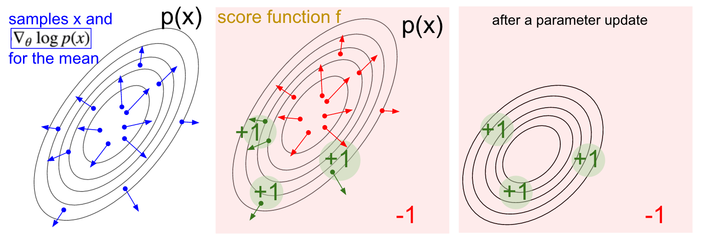

<!-- .slide: data-background="./img/blue_galactic_neural_nets.jpg" -->
<h2 class="title has-dark-background">Policy Gradient Methods</h2>

### Contents
 
 

1. Recap++
2. Motivation
3. Policy Gradient Theorem
4. Baselines
5. Actor-Critic
6. Advanced PG

<!-- .slide: .centered data-background-color="#0f132d" -->
<h2 class="title">Recap++</h2>

#### Practical advice
 

    <ul>
        <li>Log everything.</li>
        <li class="fragment">No, really, log everything:
        <ul>
            <li>Maximum Q-value</li>
            <li>TD-error</li>
            <li>Gradient magnitude</li>
            <li>Entropy, auxiliarry losses</li>
            <li>Episodic return, reward / step</li>
            <li>Mean steps / episode</li>
            <li>FPS rate</li>
            <li>Pay attention to performance</li>
        </ul>
        </li>
        <li class="fragment">Always have a distinct evaluation routine that runs a couple hundred eval episodes.</li>
        <li class="fragment">A good ideea is to also keep a cache o evaluation episodes.</li>
        <li class="fragment">Start small, find the simplest env that illustrates the problem.</li>
        <li class="fragment">At least three seeds or go home.</li>
        <li class="fragment">Log everything, question everything.</li>
    </ul>

### Value-based methods
 

<ul>
    <li>Episode: $S_0, A_0, R_1, S_1, A_1, R_2, S_2, ...$</li>
    <li class="fragment">Return: 
    $$
    \begin{aligned}
        G_t & \doteq R_{t+1}+\gamma R_{t+2}+\gamma^{2} R_{t+3}+\gamma^{3} R_{t+4}+\cdots \\
            & = R_{t+1}+\gamma\left(R_{t+2}+\gamma R_{t+3}+\gamma^{2} R_{t+4}+\cdots\right) \\
            & = R_{t+1}+\gamma G_{t+1} \end{aligned}
    $$
    </li>
    <li class="fragment"> And we care about:
    $$
    \begin{aligned}
        v_{\pi}(s) 
            & \doteq \mathbb{E}_{\pi}[G_t | S_t=s] \\
            & = \mathbb{E}_{\pi}[R_{t+1} + \gamma G_{t+1} | S_t=s] \\
            & = \mathbb{E}_{\pi}[R_{t+1} + \gamma v_{\pi}(S_{t+1}) | S_t=s]
    \end{aligned}
    $$
    </li>
    <li class="fragment">TD error: $\underbrace{R_{t+1} + \gamma V(S_{t+1})}_{\text{improved estimate}} - \underbrace{V(S_t)}_{\text{current estimate}}$</li>
</ul>

### Value Function Approximation (VFA)
 
 
 

- We can approximate the (action-)value function:
`$$
\begin{aligned}
    V_{\theta}(s) & \approx V^{\pi}(s) \\ Q_{\theta}(s, a) & \approx Q^{\pi}(s, a)
\end{aligned}
$$`

- And then derive some policy from the learned value-function.

### Value Function Approximation (VFA)
 

`$$
\begin{aligned}
    V(s, \boldsymbol{\theta}) &\doteq \sum_{i=1}^{d} \theta_{i} \phi_{i}(s) \doteq \boldsymbol{\theta}^{\top} \phi(s)\\
    V(\cdot, \boldsymbol{\theta})^{D} &= 
    \begin{bmatrix}
        \phi(s_1)^{1 \times D} \\
        \phi(s_2)^{1 \times D} \\
        \vdots    \\
        \phi(s_{N-1})^{1 \times D} \\
        \phi(s_{N})^{1 \times D} \\
    \end{bmatrix}^{N \times D}
    \times \quad
    \begin{bmatrix}
        \theta_1 \\
        \vdots   \\
        \theta_M \\
    \end{bmatrix}^{D}
\end{aligned}
$$`

 

- Possible options for $\Phi(s)$:
    - One-hot encoded matrix $\Phi(s)^{N\times N}=I$
    - Random projection $\Phi(s)^{N\times D}$, $D\ll N$.
    - "Hand-coded": distances from objects, derivatives, various patterns in board-games

### VFA Objective
 
 
 

`$$
\overline{\mathrm{VE}}(\mathbf{\theta}) \doteq \sum_{s \in \mathcal{S}} \mu(s)\left[v_{\pi}(s)-\hat{v}(s, \mathbf{\theta})\right]^{2}
$$`

 
 

- minimize the good old Mean Squared Error,
- weighted by the state distribution $\mu(s)$.
- SGD will converge to a local minimum,
- Linear VFA has only one local minimum.

#### Example: coarse coding
 

`$$
    V_{\theta}(S_t) \doteq \boldsymbol{\theta}^{\top} \phi(S_t))
$$`

`$$
\mathbf{\theta} \leftarrow 
    \mathbf{\theta}+\alpha\left[R_t+\gamma V_{\theta}(S_{t+1})-V_{\theta}(S_t)\right] \nabla V_{\theta}(S_t)
$$`

#### Dynamic Programming

$$
    V(S_t) \leftarrow
        \mathbb{E}_{\pi} \left[ R_{t+1} + \gamma V(S_{t+1}) \right] = \sum_{a} \pi(a | S_t) \sum_{s', r} p(s', r | S_t, a)[r + \gamma V(s')]
$$

### Monte Carlo VFA

`$$
    \mathbf{\theta} \leftarrow 
        \mathbf{\theta}+\alpha\left[G_{t}-\hat{v}\left(S_{t}, \mathbf{\theta}\right)\right] \nabla \hat{v}\left(S_{t}, \mathbf{\theta}\right)
$$`

### One-step Temporal Difference VFA

`$$
\mathbf{\theta} \leftarrow 
    \mathbf{\theta}+\alpha\left[R+\gamma \hat{v}\left(S^{\prime}, \mathbf{\theta}\right)-\hat{v}(S, \mathbf{\theta})\right] \nabla \hat{v}(S, \mathbf{\theta})
$$`

This is not a full gradient anymore!

<!-- .slide: data-background-color="#fff" data-background="./img/unified_view.png" data-background-size="40%" -->

### Deep Value-based RL
 

- Neural Fitted Q-learning
- Deep Q-Networks
    - Overestimation (Double Q-Learning)
    - Disambiguation (Dueling Q-Networks)
    - Prioritization (Prioritized Experience Replay)
    - Distributional perspective, auxiliary cost functions

Watch out for the deadly triad: function approximation, bootstrapping, off-policy training.

<!-- .slide: data-background-color="#fff" data-background="./img/landscape.png" data-background-size="40%" -->

<!-- .slide: .centered .contrast data-background-color="#0f132d" -->
<h2 class="title">... is this the right objective?</h2>
 

$$\pi(s, a) = \text{Pr}(a | s, \theta)$$

 

"Do not solve a more general problem an an intermediate step. -- V. Vapnik" (via <a href="https://youtu.be/y3oqOjHiliot=22">van Hasselt</a>)

Sutton & Barto, 2018, <a href="http://incompleteideas.net/book/RLbook2020.pdf?p=343">Chapter 13</a>

<!-- .slide: data-autoplay data-background-iframe="https://www.youtube.com/embed/kVmp0uGtShk" -->

### Motivation

- Effective in high-dimensional or continuous actions spaces
- Better convergence properties
- Easier to approximate?
- Can learn stochastic policies

(David Silver's, lecture)

#### Stochastic policies
 

<ul>
    <li>Iterated Rock-paper-scissors</li>
    <li class="fragment"> Aliased Grid-World
        
    </li>
</ul>

#### Policy Parametrizations
 

<ul>
    <li>Discrete:
        $$
            \pi(a | s, \boldsymbol{\theta}) \doteq \frac{e^{h(s, a, \boldsymbol{\theta})}}{\sum_{b} e^{h(s, b, \boldsymbol{\theta})}}
        $$
    </li>
    <li class="fragment">Continuous:
        $$
            \pi(a | s, \boldsymbol{\theta}) \doteq \mathcal{N}(\mu_{\theta}, \sigma^2_{\theta})
        $$
    </li>
</ul>

#### Objective
 

For performance measure:

`$$
    J(\boldsymbol{\theta}) \doteq v_{\pi_{\boldsymbol{\theta}}}\left(s_{0}\right),
$$`

be able to compute:

`$$
    \boldsymbol{\theta} \leftarrow \boldsymbol{\theta} + \alpha \nabla_{\theta} J(\boldsymbol{\theta}).
$$`

 For $\tau=s_0, a_0, r_1, s_1, a_1, r_2, s_2, ...$ can't we just: 
$$
    \nabla_{\theta} J\left(\pi_{\theta}\right)=\nabla_{\theta} \mathbb{E}_{\tau \sim \pi_{\theta}} \left[R(\tau) \right] \; ?
$$

### General case
 

Score function gradient estimator:

`$$
\begin{aligned}
    \nabla_{\theta} \mathbb E_{x \sim p(x \mid \theta)} [f(x)]
    &= \nabla_{\theta} \sum_x p(x \mid \theta) \; f(x) & \text{expected value} \\
    & = \sum_x \nabla_{\theta} p(x \mid \theta) \; f(x) & \\
    & = \sum_x p(x \mid \theta) \frac{\nabla_{\theta} p(x \mid \theta)}{p(x \mid \theta)} \; f(x) \\
    & = \sum_x p(x \mid \theta) \nabla_{\theta} \log p(x \mid \theta) \; f(x) & \text{because: } \nabla \log(z) = \frac{1}{z} \nabla z \\
    & = \mathbb E_x \left[ \; f(x) \nabla_{\theta} \log p(x \mid \theta) \right] & \text{take expectation}
\end{aligned}
$$`

    <small>Check out:</small> 
    <small>Mohammed, 2019. Monte-Carlo Estiation in ML</small> 
    <small>Schulman, 2015. Gradient Estimation Using Stochastic Computation Graphs</small>

### Intuition
 

<small class="cite">Karpathy, 2016</small>

### Policy Gradient Theorem (I)
 
 

`$$
\begin{aligned}
    \nabla_{\theta} J\left(\pi_{\theta}\right) & = \mathbb{E}_{\tau \sim \pi_{\theta}} \big[ R(\tau) \; \underbrace{\nabla_{\theta} \log P(\tau | \pi_{\theta})}_{??} \big]
\end{aligned}
$$`

### Policy Gradient Theorem (II)
 

$$
\begin{aligned}
\nabla_{\theta} \log P\left(\tau | \pi_{\theta}\right)
    & = \nabla_{\theta} \log \left(\mu\left(s_{0}\right) \prod_{t=0}^{T} P\left(s_{t+1} | s_{t}, a_{t}\right) \pi_{\theta}\left(a_{t} | s_{t}\right)\right) \\
    & = \nabla_{\theta}\left(\log \mu\left(s_{0}\right)+\sum_{t=0}^{T}\left(\log P\left(s_{t+1} | s_{t}, a_{t}\right)+\log \pi_{\theta}\left(a_{t} | s_{t}\right)\right)\right) \\
    & = \nabla_{\theta} \log \mu\left(s_{0}\right)+\sum_{t=0}^{T}\left(\nabla_{\theta} \log P\left(s_{t+1} | s_{t}, a_{t}\right)+\nabla_{\theta} \log \pi_{\theta}\left(a_{t} | s_{t}\right)\right) \\
    & = \color{#BD1421}{\nabla_{\theta} \log \mu\left(s_{0}\right)} + \sum_{t=0}^{T}\left(
        \color{#BD1421}{\nabla_{\theta} \log P\left(s_{t+1} | s_{t}, a_{t}\right)}
        +\nabla_{\theta} \log \pi_{\theta}\left(a_{t} | s_{t}\right)
        \right) \\
    & = \sum_{t=0}^{T} \nabla_{\theta} \log \pi_{\theta}\left(a_{t} | s_{t}\right)
\end{aligned}
$$

### Policy Gradient Theorem (III)
 
 

`$$
\begin{aligned}
    \nabla_{\theta} J\left(\pi_{\theta}\right) 
        & = \mathbb{E}_{\tau \sim \pi_{\theta}} \big[ R(\tau) \; \underbrace{\nabla_{\theta} \log P(\tau | \pi_{\theta})}_{??} \big] \\
        & = \mathbb{E}_{\tau \sim \pi_{\theta}} \left[\underbrace{R(\tau)}_{??} \sum_{t=0}^{T} \nabla_{\theta} \log \pi_{\theta}\left(a_{t} | s_{t}\right) \right] \\
        & = \mathbb{E}_{\tau \sim \pi_{\theta}} \left[\sum_{t=t^{\prime}}^T r_{t^{\prime}} \sum_{t=0}^{T} \nabla_{\theta} \log \pi_{\theta}\left(a_{t} | s_{t}\right) \right]
\end{aligned}
$$`

#### Monte-Carlo PG. Aka REINFORCE
 

`$$
    \nabla_{\theta} J(\theta) = \mathbb{E}_{\pi_{\theta}}\left[\nabla_{\theta} \log \pi_{\theta}(s, a) \; \color{#BD1421}{ G_t } \right]
$$`

 

<pre><code class="hljs" data-trim data-line-numbers="1-9">
pi(a | s, w)        # parametrized policy
alpha > 0           # step size
w = randn((D,))     # weights

# tau = trajectory s0, a0, r1, ..., s_T-1, a_T-1, r_T ~ pi
for each tau ~ pi(. | ., w):
    for each t in tau:
        G_t = sum(r_t':T)
        w += alpha * G_t * grad(log(pi(a_t | s_t, w)))
</code></pre>

#### Concrete example
 
 
 

- Consider a Gaussian policy $\pi(a | s, \boldsymbol{\theta}) \doteq \mathcal{N}(\mu_{\theta}(S_t), \sigma^2_{\theta})$
- The gradient of the log policy is then:

`$$
    \nabla_{\theta} \log \pi_{\theta}(s, a) = \frac{A_t - \mu_{\theta}(S_t)}{\sigma^2} \nabla \mu_{\theta}(S_t)
$$`

- if the return was positive then the mean would be updated towards the action we took
- the update becomes:

`$$
    \theta_{t+1} = \theta_{t} + \alpha G_t \frac{A_t - \mu_{\theta}(S_t)}{\sigma^2} \nabla \mu_{\theta}(S_t)
$$`

#### Baselines
 

`$$
    \nabla_{\theta} J(\theta) = \mathbb{e}_{\pi_{\theta}}\left[\nabla_{\theta} \log \pi_{\theta}(s, a) \; (G_t \color{#bd1421}{ -b(s_t) }) \right]
$$`

As long as the baseline does not depend  on $a_t$ it can be shown:

- that the estimator remains unbiased
- that it will reduce the variance of the estimator

This leads to the following update:

`$$
\theta_{t+1} = \theta_{t} + \alpha (G_t - b(S_t)) \nabla_{\theta} \log \pi_{\theta} (A_t | S_t)
$$`

#### Baselines can be unbiased
 

`$$
\begin{aligned}
    \mathbb{E}[\color{#BD1421}{b} \nabla_{\theta} \log \pi_{\theta}(S_t | A_t)]
        & = \mathbb{E} \left[ \sum_a \pi(a | S_t) \color{#BD1421}{b} \nabla_{\theta} \log \pi(a | S_t) \right] \\
        & = \mathbb{E} \left[ \color{#BD1421}{b} \nabla_{\theta} \sum_a \pi(a | S_t) \right] \\
        & = \mathbb{E} \left[ \color{#BD1421}{b} \nabla_{\theta} 1 \right] \\
        & = 0
\end{aligned}
$$`

#### Baselines for controlling variance
 

$$
\begin{align}
    {\rm Var}\left(\sum_{t=0}^{T-1}\nabla_\theta \log \pi_\theta(A_t|S_t) (R_t(\tau)-b)\right) \;
        & \overset{(i)}{\approx}\; \sum_{t=0}^{T-1} \mathbb{E}\tau\left[\Big(\nabla_\theta \log \pi_\theta(A_t|S_t) (R_t(\tau)-b)\Big)^2\right] \\
        & \overset{(ii)}{\approx}\; \sum_{t=0}^{T-1} \mathbb{E}_\tau \left[\Big(\nabla_\theta \log \pi_\theta(A_t|S_t)\Big)^2\right]\mathbb{E}_\tau\left[\Big(R_t(\tau) - b)^2\right]
\end{align}
$$

**Approximations:** i) variance of a sum ~ sum of variances, ii) independence of the terms in the expectation

Reason for choosing $b \approx \mathbb{E} [R_t(\tau)]$, as often seen in the literature
([more details](https://danieltakeshi.github.io/2017/03/28/going-deeper-into-reinforcement-learning-fundamentals-of-policy-gradients/)).

#### Baselines. Advantage Estimates
 

$$
\begin{aligned} \nabla_{\theta} J(\theta)
    \nabla_{\theta} J(\theta) 
        & = \mathbb{E}_{\pi_{\theta}}\left[\nabla_{\theta} \log \pi_{\theta}(s, a) \; (\color{#BD1421}{ Q^{\pi}_{\phi}(s, a) - V^{\pi}_{\phi}(s) }) \right] \\
        & = \mathbb{E}_{\pi_{\theta}}\left[\nabla_{\theta} \log \pi_{\theta}(s, a) \; \color{#BD1421}{ A^{\pi}_{\phi}(s, a) } \right] \\
\end{aligned}
$$

#### Advantage Estimates (II)

 N-Step Advantage Estimate:
$$
A_{t}^{\pi(n)} = 
    \underbrace{\sum_{t^{\prime}=t}^{n} \gamma^{t^{\prime}-t} r_{t^{\prime}}+\gamma^{n+1} V_{\phi}\left(s_{t+n+1}\right)}_{\approx Q^{\pi}}
    -\underbrace{V_{\phi}\left(s_{t}\right)}_{\approx V \pi}
$$

 Generalized Advantage Estimate:
$$
\begin{aligned} A_{t}^{\pi, \lambda} 
    &=(1-\lambda) \sum_{n=0}^{\infty} \lambda^{n} A_{t}^{\pi(n)} \\
    &=\sum_{t^{\prime}=t}^{\infty}(\gamma \lambda)^{t^{\prime}-t}\left(r_{t^{\prime}}+\gamma V_{\phi}\left(s_{t^{\prime}+1}\right)-V_{\phi}\left(s_{t^{\prime}}\right)\right)
\end{aligned}
$$

<!-- .slide: data-background-color="#fff" data-background-size="40%" data-background="./img/td_lambda.png" -->

##### Policy Gradient Theorem (IV)

Alternate forms:
$$
\begin{aligned} \nabla_{\theta} J(\theta)
    &=\mathbb{E}_{\pi_{\theta}}\left[\nabla_{\theta} \log \pi_{\theta}(s, a) \; \color{#BD1421}{ G_t } \right] & \text { REINFORCE } \\
    &=\mathbb{E}_{\pi_{\theta}}\left[\nabla_{\theta} \log \pi_{\theta}(s, a) \; \color{#BD1421}{ Q^{\phi}(s, a) } \right] &  \text { Q Actor-Critic } \\
    &=\mathbb{E}_{\pi_{\theta}}\left[\nabla_{\theta} \log \pi_{\theta}(s, a) \; \color{#BD1421}{ A^{\phi}(s, a) } \right] & \text { Actor-Critic } \\
    &=\mathbb{E}_{\pi_{\theta}}\left[\nabla_{\theta} \log \pi_{\theta}(s, a) \; \color{#BD1421}{ \delta } \right] &  \text { TD Actor-Critic } \\
    &=\mathbb{E}_{\pi_{\theta}}\left[\nabla_{\theta} \log \pi_{\theta}(s, a) \; \color{#BD1421}{ \delta e } \right] &  \operatorname{TD}(\lambda) \text { Actor-Critic }
\end{aligned}
$$

#### Baselines
 

### Actor-Critic methods
 

Actor-Critic methods maintain two sets (or more) of parameters:

- Critic updates (action-)value function parameters $\phi$
- Actor updates policy parameters $\theta$ in the direction suggested by the critic.

### Asynchronous Advantage Actor-Critic (A3C)
 

<ul>
    <li>Update the policy with $\nabla_{\theta^{\prime}} \log \pi\left(a_{t} | s_{t} ; \theta^{\prime}\right) A\left(s_{t}, a_{t} ; \theta, \theta_{v}\right)$...</li>
    <li>... where $A\left(s_{t}, a_{t}\right) = \sum_{i=0}^{k-1} \gamma^{i} r_{t+i}+\gamma^{k} V\left(s_{t+k} ; \theta_{v}\right)-V\left(s_{t} ; \theta_{v}\right)$.</li>
    <li>Add a regularization term $\beta \nabla_{\theta^{\prime}} H\left(\pi\left(s_{t} ; \theta^{\prime}\right)\right)$</li>
    <li>Spawn agents on multiple threads, each interacting in separate environments, all updating the same set of parameters $\theta$.</li>
</ul>

<!-- .slide: data-background-color="#fff" data-background-size="70%" data-background="./img/a3c.png" -->

<!-- .slide: data-background-color="#fff" data-background-size="70%" data-background="./img/a3c_results.png" -->

<!-- .slide: .centered data-background-color="#0f132d" -->
<h2 class="title">Advanced Policy Gradients</h2>
<h4 class="title">(next time)</h4>

### Problems with PG
 
 

- Hard to choose stepsize
    - exacerbated by the data being nonstationary.
    - small change in parameters leads to large change in policy.
- PG methods are online, leading to worse sample efficiency 

### Importance Sampling
 
 
 

- In PG we optimize the loss:
`$$
L^{P G}(\theta)=\mathbb{E}_{t}\left[\log \pi_{\theta}\left(a_{t} | s_{t}\right) A_{t}\right]
$$`

- Equivalently:
`$$
L_{\theta_{\mathrm{old}}}^{I S}(\theta)=\mathbb{E}_{t}\left[\frac{\pi_{\theta}\left(a_{t} | s_{t}\right)}{\pi_{\theta_{\mathrm{old}}}\left(a_{t} | s_{t}\right)} A_{t}\right]
$$`

- In practice this is not that different.

<!-- .slide: data-background-color="#fff" -->
#### Importance sampling
 

Can we evaluate target policy $\pi$ on data collected by behaviour policy $\mu$?

<small class="cite">Munos, 2018</small>

<!-- .slide: data-background-color="#fff" -->
#### Importance sampling
 
 

`$$
J(\theta) = 
    \mathbb{E}_{s \sim \rho^{\mu_{\theta}}, a \sim \mu_{\theta}} \big[ \frac{\pi_\theta(a \vert s)}{\mu_{\theta}(a \vert s)} A_{\mu}(s, a) \big]
$$`

#### Trust Region Policy Optimization
 
 

- Trust region update:
`$$
\begin{aligned}
    \text{maximize}_{\theta} & \quad L_{\theta_{\mathrm{old}}}^{I S}(\theta)=\mathbb{E}_t \left[\frac{\pi_{\theta}\left( a_t | s_t \right)}{\pi_{\theta_{\mathrm{old}}}\left( a_t | s_t \right)} A_t \right] \\
    \text{subject to}        & \quad \mathbb{E}_t \left[\mathrm{KL}\left[\pi_{\theta_{\mathrm{old}}}\left(\cdot | s_{t}\right), \pi_{\theta}\left(\cdot | s_{t}\right)\right]\right] \leq \delta
\end{aligned}
$$`

- Efficient way to compute the gradients of these two terms which include 2nd order derivatives.

#### TRPO. Taylor expansion
 
 

Loss:
$$
L_{\theta_{\mathrm{old}}}(\theta) = L_{\theta_{\mathrm{old}}}(\theta) + \mathbf{g}^T(\theta - \theta_{\mathrm{old}})
$$
Constraint:
$$
\mathrm{KL}[\pi_{\mathrm{old}}, \pi] = \mathrm{KL}[\pi_{\mathrm{old}}, \pi_{\mathrm{old}}] + 
                                       \nabla \mathrm{KL}[\pi_{\mathrm{old}}, \pi](\theta - \theta_{\mathrm{old}})
                                       + \frac{1}{2}(\theta - \theta_{\mathrm{old}})^T \mathbf{H}(\theta - \theta_{\mathrm{old}})
$$
Thus:
$$
\begin{aligned}
\theta_{t+1}  = & \; \text{argmax}_{\theta} \; \mathbf{g}^T(\theta - \theta_{\mathrm{old}}) \\
                & \; \text{s.t.}  \frac{1}{2}(\theta - \theta_{\mathrm{old}})^T \mathbf{H}(\theta - \theta_{\mathrm{old}}) \le \delta
\end{aligned}
$$

#### TRPO. The search direction
 

We have the optimization problem:
$$
\begin{aligned}
\theta_{t+1}  = & \; \text{argmax}_{\theta} \; \mathbf{g}^T(\theta - \theta_{\mathrm{old}}) \\
                & \; \text{s.t.}  \frac{1}{2}(\theta - \theta_{\mathrm{old}})^T \mathbf{H}(\theta - \theta_{\mathrm{old}}) \le \delta
\end{aligned}
$$

Lagrange multiplier:
$$
G = \mathbf{g}^T \mathbf{s} - \lambda \frac{1}{2} \mathbf{s}^T \mathbf{H} \mathbf{s}
$$

Differentiate w.r.t. $\mathbf{s}$ and set to 0:
$$
\frac{\partial G}{\partial \mathbf{s}} = \mathbf{g} - \lambda \mathbf{H}\mathbf{s} = 0
$$
Direction is given by solving $\mathbf{H}\mathbf{s} = \mathbf{g}$.

#### TRPO. Sum-up:
 

    <ul>
        <li>Purely optimization formulation</li>
        <li class="fragment">Solve a constraint optimization problem so that $\pi, \pi_{\text{old}}$ stay close during an update</li>
        <li class="fragment">Do a linear approximation to $L(\theta)$ and quadratic to the $\text{KL}$ constraint</li>
        <li class="fragment">Use conjugate gradient to get an optimization direction: $\mathbf{s} \sim \mathbf{H}^{-1} \mathbf{g}$</li>
        <li class="fragment">Compute the step $\beta = \sqrt{\frac{2\delta}{\mathbf{s}^T\mathbf{Hs}}}$</li>
    </ul>

#### Proximal Policy Optimization
 

- Force the importance sampling ratio to stay within $[1-\varepsilon, 1+\varepsilon]$
`$$
L^{CLIP}(\theta) = \mathbb{E}_{t}\big[ \min \big( \; \underbrace{r_t(\theta)A_t}_{L^{IS}(\theta)}, \; \text{clip}(r_t(\theta), 1 - \varepsilon, 1 + \varepsilon) A_t \big) \big]
$$`

with $r_t(\theta) = \frac{\pi_{\theta}(a | s)}{\pi_{\theta_{\text{old}}}(a | s)}$
 

- This avoids extreme policy updates.
- The value function is trained as usual, with TDE.

<!-- .slide: data-background-color="#fff" -->
#### PPO intuition
  

<!-- .slide: data-background-color="#fff" -->
#### IMPALA
 

Remember A3C is essentially online. IMPALA needs to deal with off-policy data.

<!-- .slide: data-background-color="#fff" -->
#### IMPALA V-Trace
 

$$
v_s \doteq V(x_s) + \sum_{t=s}^{s+n-1} \gamma^{t-s} \left( \prod_{i=s}^{t-1} c_i \right) 
    \underbrace{\rho_t \left( r_t + \gamma V(x_{t+1}) - V(x_t) \right)}_{\delta_tV}
$$
with $\rho_i = \text{min}\left( \overline{\rho}, \, \frac{\pi(a_i|s_i)}{\mu(a_i|s_i)} \right)$ and 
$c_i = \text{min}\left( \overline{c}, \, \frac{\pi(a_i|s_i)}{\mu(a_i|s_i)} \right)$.

# Questions?